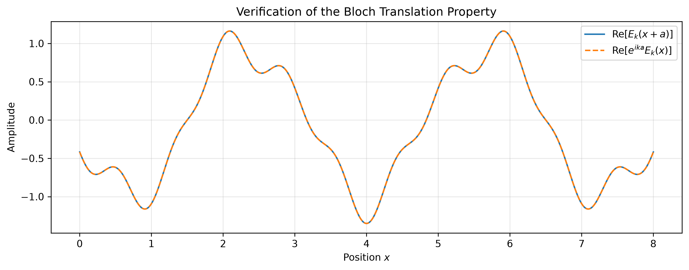
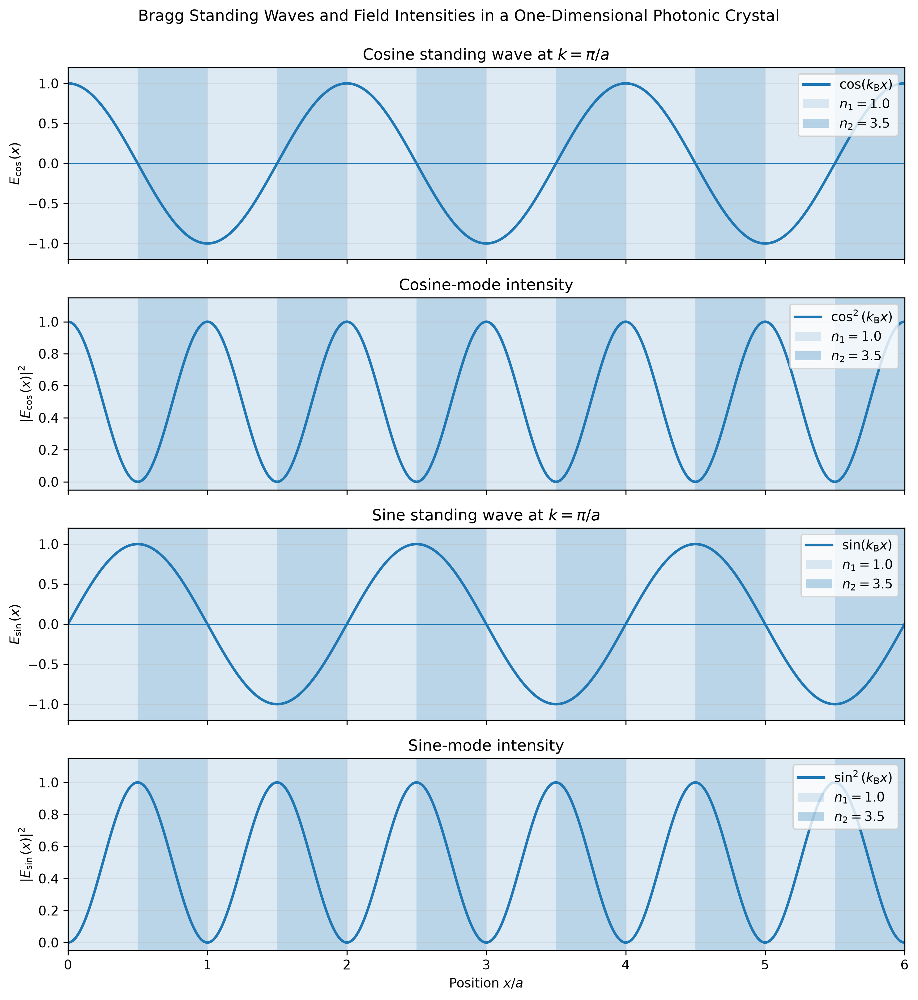
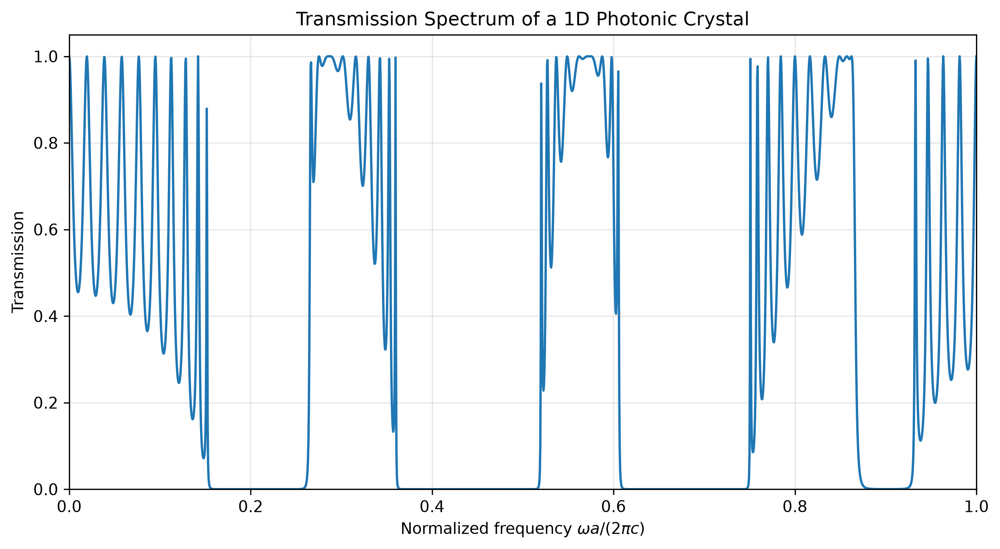
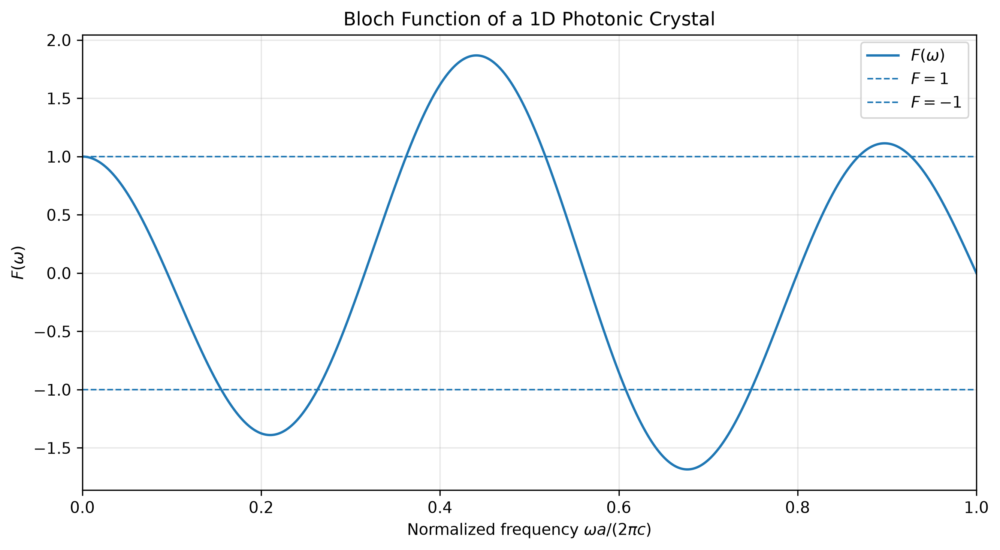
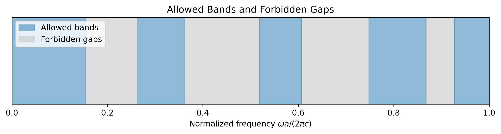
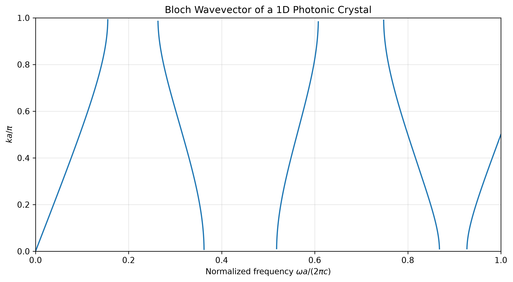
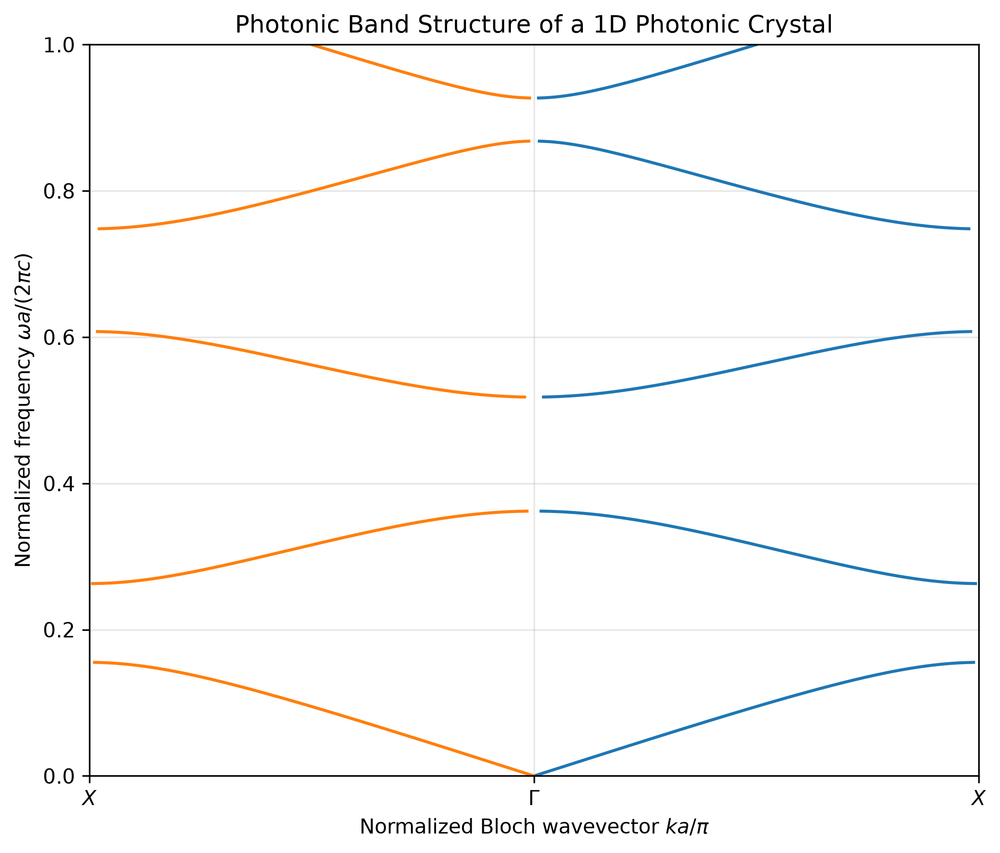

# computational-photonic-crystals

Develop numerical and visual models of one-dimensional and two-dimensional
photonic crystals, progressing from Bragg scattering and Bloch waves to band
structures, photonic band gaps, defect cavities, and waveguides.

## Implemented Modules

### P01 — One-Dimensional Periodic Dielectric

Construct a one-dimensional periodic dielectric profile consisting of alternating
materials with different refractive indices.

#### Parameters

- Material A refractive index: $n_1 = 1.0$
- Material B refractive index: $n_2 = 3.5$
- Lattice constant: $a = 1.0$
- Number of unit cells: $10$
- Fill fraction: $0.5$

#### Model

The refractive-index profile alternates periodically between two materials within
each unit cell.

#### Output

<p align="center">
  
</p>

This periodic refractive-index profile serves as the fundamental model for
subsequent photonic-crystal simulations, including Bloch-wave propagation,
band-structure calculations, and transfer-matrix analysis.

### P02 — Bloch Wave Visualization

Visualize the structure of a one-dimensional Bloch wave and compare its periodic
part, plane-wave factor, and complete spatial form.

#### Parameters

- Lattice constant: $a = 1.0$
- Number of unit cells: $8$
- Wave vector: $k = 0.6\pi/a$
- Periodic modulation amplitude: $A = 0.35$

#### Model

A Bloch wave is written as

$$
E_k(x) = u_k(x)e^{ikx},
$$

where the periodic part satisfies

$$
u_k(x+a) = u_k(x).
$$

For visualization, the periodic part is modeled as

$$
u_k(x) = 1 + A\cos(Gx),
$$

with

$$
G = \frac{2\pi}{a}.
$$

The script compares:

1. the periodic part $u_k(x)$,
2. the real part of the plane wave $e^{ikx}$,
3. the real part of the complete Bloch wave $E_k(x)$.

Vertical dashed lines indicate neighboring unit-cell boundaries.

#### Output

<p align="center">
  
</p>

The first figure compares the periodic part, the plane-wave factor, and the
complete Bloch wave.

<p align="center">
  
</p>

The second figure verifies the Bloch translation property by comparing
$E_k(x+a)$ with $e^{ika}E_k(x)$. The two curves overlap, confirming that

$$
E_k(x+a) = e^{ika}E_k(x).
$$

### P03 — Bragg Scattering and Standing Waves

Visualize the formation of standing waves produced by Bragg coupling at the
boundary of the first Brillouin zone, and compare their field-intensity
distributions within the periodic dielectric structure.

#### Parameters

- Material A refractive index: $n_1 = 1.0$
- Material B refractive index: $n_2 = 3.5$
- Lattice constant: $a = 1.0$
- Number of unit cells: $6$
- Fill fraction: $0.5$
- Bragg wave vector: $k_{\mathrm{B}} = \pi/a$

#### Model

At the boundary of the first Brillouin zone,

$$
k_{\mathrm{B}} = \frac{\pi}{a},
$$

the reciprocal-lattice vector is

$$
G = \frac{2\pi}{a}.
$$

The periodic dielectric structure couples the forward-propagating wave
$e^{ik_{\mathrm{B}}x}$ to the backward-propagating wave
$e^{-ik_{\mathrm{B}}x}$ because

$$
k_{\mathrm{B}} - G = -k_{\mathrm{B}}.
$$

The forward- and backward-propagating waves can be combined as

$$
e^{ik_{\mathrm{B}}x} + e^{-ik_{\mathrm{B}}x}
= 2\cos(k_{\mathrm{B}}x),
$$

and

$$
e^{ik_{\mathrm{B}}x} - e^{-ik_{\mathrm{B}}x}
= 2i\sin(k_{\mathrm{B}}x).
$$

The symmetric and antisymmetric combinations of these counter-propagating
waves form two standing-wave modes:

$$
E_{\cos}(x) = \cos(k_{\mathrm{B}}x),
$$

$$
E_{\sin}(x) = \sin(k_{\mathrm{B}}x).
$$

Their corresponding field intensities are

$$
|E_{\cos}(x)|^2 = \cos^2(k_{\mathrm{B}}x),
$$

$$
|E_{\sin}(x)|^2 = \sin^2(k_{\mathrm{B}}x).
$$

Although the two modes have the same wave-vector magnitude, their intensity
maxima occur in different parts of the unit cell. As a result, they overlap
differently with the high- and low-index materials and acquire different
eigenfrequencies.

This frequency splitting at the Brillouin-zone boundary illustrates the
physical origin of the photonic band gap.

#### Output

<p align="center">
  
</p>

The figure compares the two standing-wave fields and their corresponding
intensity distributions against the periodic dielectric background.

### P04 — Transfer Matrix and Transmission Spectrum

Calculate the transmission spectrum of a finite one-dimensional photonic crystal
using the transfer-matrix method.

#### Parameters

- Material A refractive index: $n_1 = 1.0$
- Material B refractive index: $n_2 = 3.5$
- Lattice constant: $a = 1.0$
- Fill fraction: $0.5$
- Number of unit cells: $10$

#### Model

Within each homogeneous dielectric layer, the electric field is represented as
a superposition of right- and left-propagating waves:

$$
E(x) = A e^{iqx} + B e^{-iqx},
$$

where

$$
q = \frac{n\omega}{c}.
$$

Propagation through a layer of thickness $d$ is described by the propagation
matrix

$$
P(n,d,\omega)
=
\begin{pmatrix}
e^{iqd} & 0 \\
0 & e^{-iqd}
\end{pmatrix}.
$$

At an interface between two dielectric materials with refractive indices
$n_i$ and $n_j$, the wave amplitudes are related by an interface matrix.

Combining the propagation and interface matrices gives the transfer matrix of
one unit cell. Repeating the unit-cell matrix over multiple periods gives the
total transfer matrix of the finite photonic crystal:

$$
M_{\mathrm{total}} = M_{\mathrm{cell}}^N,
$$

where $N$ is the number of unit cells.

For incidence and exit through the same surrounding medium, the power
transmission coefficient is calculated from the transmission amplitude $t$ as

$$
T = |t|^2.
$$

#### Output

<p align="center">
  
</p>

The transmission spectrum contains frequency intervals with high transmission
and intervals in which transmission is strongly suppressed. The low-transmission
regions indicate the formation of photonic stop bands in the finite periodic
structure.

### P05 — Allowed and Forbidden Frequency Bands

Use the transfer matrix of one unit cell to determine the allowed and forbidden
frequency regions of an infinite one-dimensional photonic crystal.

#### Parameters

- Material A refractive index: $n_1 = 1.0$
- Material B refractive index: $n_2 = 3.5$
- Lattice constant: $a = 1.0$
- Fill fraction: $0.5$

#### Model

According to Bloch's theorem, the field amplitudes in neighboring unit cells are
related by

$$
\begin{pmatrix}
A(x+a) \\
B(x+a)
\end{pmatrix}
=
e^{ika}
\begin{pmatrix}
A(x) \\
B(x)
\end{pmatrix}.
$$

Therefore, the Bloch factor $e^{ika}$ is an eigenvalue of the unit-cell transfer
matrix $M$.

For a lossless unit cell,

$$
\det(M) = 1,
$$

and the eigenvalue equation gives the Bloch dispersion relation

$$
\cos(ka) = \frac{1}{2}\operatorname{Tr}(M).
$$

Define the Bloch function

$$
F(\omega) = \frac{1}{2}\operatorname{Tr}(M).
$$

When

$$
|F(\omega)| \leq 1,
$$

a real Bloch wavevector exists, so the corresponding frequency belongs to an
allowed photonic band.

When

$$
|F(\omega)| > 1,
$$

the Bloch wavevector becomes complex. The field then decays exponentially
through the crystal, and the corresponding frequency lies inside a forbidden
band or photonic band gap.

#### Output

<p align="center">
  
</p>

The Bloch function is compared with the boundaries $F=1$ and $F=-1$.
Frequencies for which the curve lies between these boundaries support real
Bloch wavevectors.

<p align="center">
  
</p>

The second figure classifies the frequency axis into allowed and forbidden
regions using the condition $|F(\omega)| \leq 1$.

### P06 — Complex Bloch Wavevector

Calculate the real and imaginary parts of the Bloch wavevector across both
allowed and forbidden frequency regions.

#### Parameters

- Material A refractive index: $n_1 = 1.0$
- Material B refractive index: $n_2 = 3.5$
- Lattice constant: $a = 1.0$
- Fill fraction: $0.5$

#### Model

The Bloch wavevector is obtained from the dispersion relation

$$
\cos(ka) = F(\omega),
$$

where

$$
F(\omega) = \frac{1}{2}\operatorname{Tr}(M).
$$

It can therefore be written as

$$
k(\omega) = \frac{1}{a}\cos^{-1}\left[F(\omega)\right].
$$

Inside an allowed band, $|F(\omega)|\leq 1$, so $k$ is real and the Bloch wave
propagates through the periodic structure.

Inside a forbidden band, $|F(\omega)|>1$, so $k$ becomes complex:

$$
k = k_{\mathrm{r}} + i k_{\mathrm{i}}.
$$

The corresponding Bloch factor is

$$
e^{ikx}
=
e^{ik_{\mathrm{r}}x}e^{-k_{\mathrm{i}}x}.
$$

The real part $k_{\mathrm{r}}$ describes the spatial phase variation, while the
imaginary part $k_{\mathrm{i}}$ gives the exponential attenuation rate inside
the photonic band gap.

#### Output

<p align="center">
  
</p>

The real part of the Bloch wavevector varies across the allowed bands, while a
nonzero imaginary part appears inside the forbidden frequency regions. This
directly shows the transition from propagating Bloch waves to evanescent Bloch
waves.

### P07 — Photonic Band Structure

Construct the photonic band structure of the one-dimensional periodic dielectric
from the real Bloch wavevectors obtained in the allowed frequency regions.

#### Parameters

- Material A refractive index: $n_1 = 1.0$
- Material B refractive index: $n_2 = 3.5$
- Lattice constant: $a = 1.0$
- Fill fraction: $0.5$

#### Model

The photonic band structure represents the relationship between the allowed
frequencies and the corresponding real Bloch wavevectors.

For each normalized frequency, the unit-cell transfer matrix is constructed and
the Bloch relation

$$
\cos(ka) = \frac{1}{2}\operatorname{Tr}(M)
$$

is evaluated.

Only frequencies satisfying

$$
\left|
\frac{1}{2}\operatorname{Tr}(M)
\right|
\leq 1
$$

are included because these frequencies produce real Bloch wavevectors.

The horizontal axis is the normalized Bloch wavevector

$$
\frac{ka}{\pi},
$$

and the vertical axis is the normalized frequency

$$
\frac{\omega a}{2\pi c}.
$$

The band structure is displayed along the one-dimensional high-symmetry path

$$
X \rightarrow \Gamma \rightarrow X,
$$

where

$$
\Gamma: k=0
$$

and

$$
X: k=\pm\frac{\pi}{a}.
$$

#### Output

<p align="center">
  
</p>

Each continuous branch represents an allowed photonic band. The empty frequency
intervals separating neighboring branches are photonic band gaps, in which no
real Bloch wavevector exists.

## Project Structure

```text
computational-photonic-crystals/
├── scripts/
│   ├── p01_periodic_dielectric.py
│   ├── p02_bloch_wave_visualization.py
│   ├── p03_bragg_standing_waves.py
│   ├── p04_transfer_matrix.py
│   ├── p05_bloch_band_structure.py
│   ├── p06_bloch_wavevector.py
│   └── p07_photonic_band_structure.py
├── utils/
│   ├── transfer_matrix_utils.py
│   └── bloch_utils.py
├── figures/
│   ├── p01_periodic_dielectric.png
│   ├── p02_bloch_wave_visualization.png
│   ├── p02_bloch_translation_verification.png
│   ├── p03_bragg_standing_waves.png
│   ├── p04_transmission_spectrum.png
│   ├── p05_bloch_function.png
│   ├── p05_allowed_forbidden_bands.png
│   ├── p06_bloch_wavevector.png
│   └── p07_photonic_band_structure.png
├── docs/
├── requirements.txt
├── .gitignore
└── README.md
```

## Status

The one-dimensional photonic-crystal foundation is complete, including periodic
dielectric modeling, Bloch waves, Bragg standing waves, transfer-matrix analysis,
photonic band-gap identification, complex Bloch wavevectors, and photonic band
structures.
Further development will extend the project to defect modes, optical cavities,
waveguides, and two-dimensional photonic crystals.
