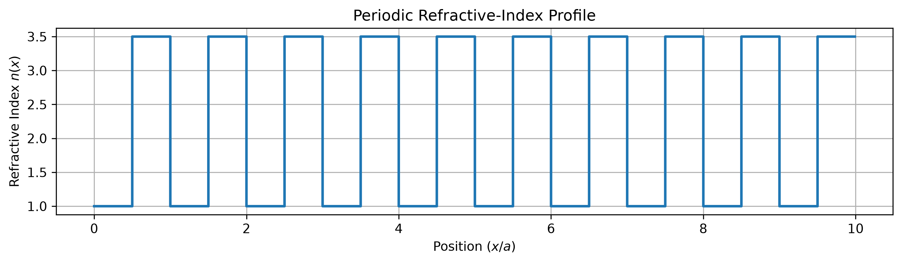
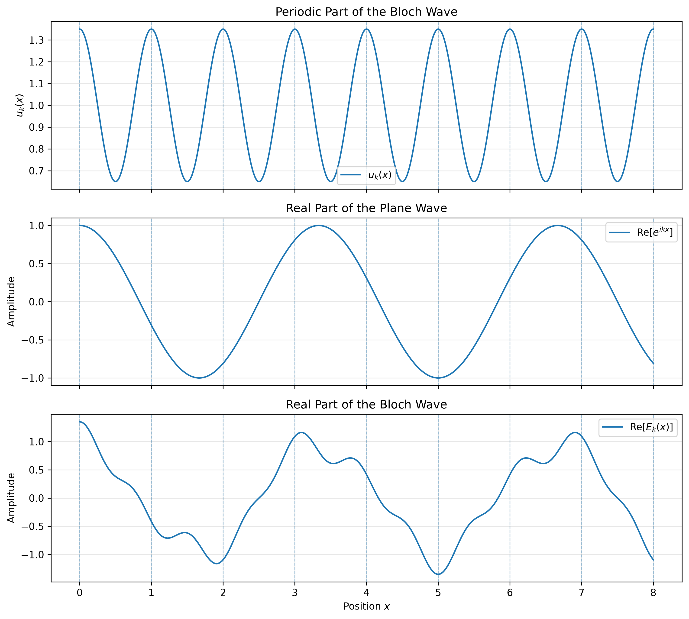

# computational-photonic-crystals

Develop numerical and visual models of one-dimensional and two-dimensional
photonic crystals, progressing from Bragg scattering and Bloch waves to band
structures, photonic band gaps, defect cavities, and waveguides.

### P01 — One-Dimensional Periodic Dielectric

Construct a one-dimensional periodic dielectric profile consisting of alternating
materials with different refractive indices.

#### Parameters

- Material A refractive index: $n_1 = 1.0$
- Material B refractive index: $n_2 = 3.5$
- Lattice constant: $a = 1.0$
- Number of unit cells: $10$
- Fill fraction: $0.5$

#### Model

The refractive-index profile alternates periodically between two materials within
each unit cell.

#### Output

  

This periodic refractive-index profile serves as the fundamental model for
subsequent photonic-crystal simulations, including Bloch-wave propagation,
band-structure calculations, and transfer-matrix analysis.

### P02 — Bloch Wave Visualization

Visualize the structure of a one-dimensional Bloch wave and compare its periodic
part, plane-wave factor, and complete spatial form.

#### Parameters

- Lattice constant: $a = 1.0$
- Number of unit cells: $8$
- Wave vector: $k = 0.6\pi/a$
- Periodic modulation amplitude: $A = 0.35$

#### Model

A Bloch wave is written as

$$
E_k(x) = u_k(x)e^{ikx},
$$

where the periodic part satisfies

$$
u_k(x+a) = u_k(x).
$$

For visualization, the periodic part is modeled as

$$
u_k(x) = 1 + A\cos(Gx),
$$

with

$$
G = \frac{2\pi}{a}.
$$

The script compares:

1. the periodic part $u_k(x)$,
2. the real part of the plane wave $e^{ikx}$,
3. the real part of the complete Bloch wave $E_k(x)$.

Vertical dashed lines indicate neighboring unit-cell boundaries.

#### Output

  

The visualization shows that the periodic part repeats in every unit cell, while
the complete Bloch wave accumulates a phase across the lattice according to

$$
E_k(x+a) = e^{ika}E_k(x).
$$
