# computational-photonic-crystals

Develop numerical and visual models of one-dimensional and two-dimensional
photonic crystals, progressing from Bragg scattering and Bloch waves to band
structures, photonic band gaps, defect cavities, and waveguides.

## Implemented Modules

### P01 — One-Dimensional Periodic Dielectric

Construct a one-dimensional periodic dielectric profile consisting of alternating
materials with different refractive indices.

#### Parameters

- Material A refractive index: $n_1 = 1.0$
- Material B refractive index: $n_2 = 3.5$
- Lattice constant: $a = 1.0$
- Number of unit cells: $10$
- Fill fraction: $0.5$

#### Model

The refractive-index profile alternates periodically between two materials within
each unit cell.

#### Output

<p align="center">
  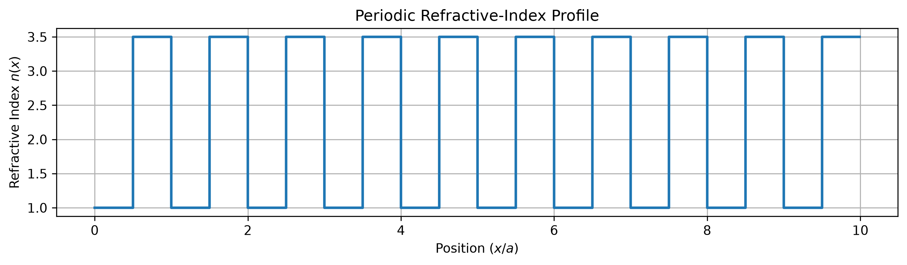
</p>

This periodic refractive-index profile serves as the fundamental model for
subsequent photonic-crystal simulations, including Bloch-wave propagation,
band-structure calculations, and transfer-matrix analysis.

### P02 — Bloch Wave Visualization

Visualize the structure of a one-dimensional Bloch wave and compare its periodic
part, plane-wave factor, and complete spatial form.

#### Parameters

- Lattice constant: $a = 1.0$
- Number of unit cells: $8$
- Wave vector: $k = 0.6\pi/a$
- Periodic modulation amplitude: $A = 0.35$

#### Model

A Bloch wave is written as

```math
E_k(x) = u_k(x)e^{ikx},
```

where the periodic part satisfies

```math
u_k(x+a) = u_k(x).
```

For visualization, the periodic part is modeled as

```math
u_k(x) = 1 + A\cos(Gx),
```

with

```math
G = \frac{2\pi}{a}.
```

The script compares:

1. the periodic part $u_k(x)$,
2. the real part of the plane wave $e^{ikx}$,
3. the real part of the complete Bloch wave $E_k(x)$.

Vertical dashed lines indicate neighboring unit-cell boundaries.

#### Output

<p align="center">
  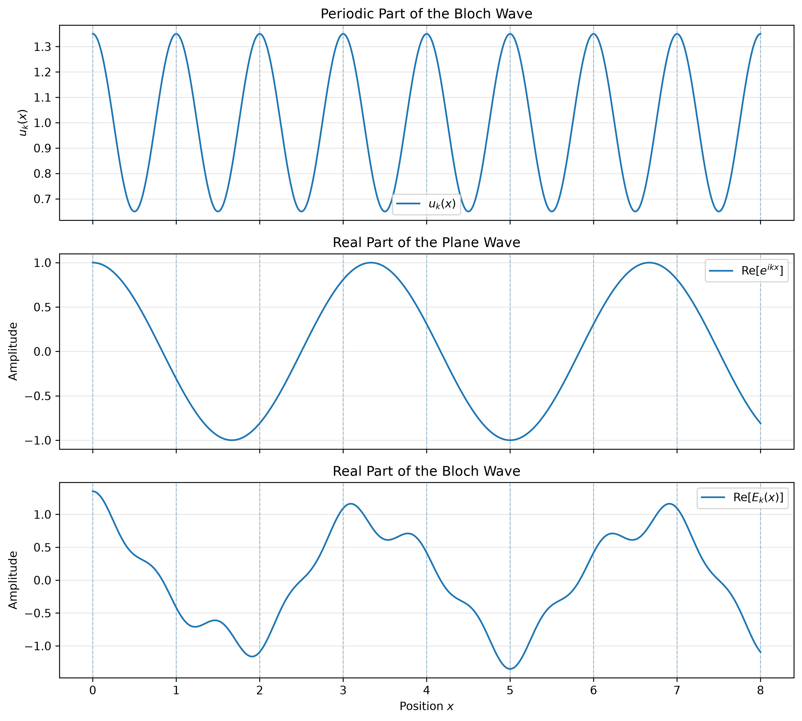
</p>

The first figure compares the periodic part, the plane-wave factor, and the
complete Bloch wave.

<p align="center">
  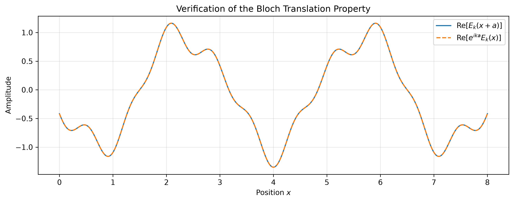
</p>

The second figure verifies the Bloch translation property by comparing
$E_k(x+a)$ with $e^{ika}E_k(x)$. The two curves overlap, confirming that

```math
E_k(x+a) = e^{ika}E_k(x).
```

### P03 — Bragg Scattering and Standing Waves

Visualize the formation of standing waves produced by Bragg coupling at the
boundary of the first Brillouin zone, and compare their field-intensity
distributions within the periodic dielectric structure.

#### Parameters

- Material A refractive index: $n_1 = 1.0$
- Material B refractive index: $n_2 = 3.5$
- Lattice constant: $a = 1.0$
- Number of unit cells: $6$
- Fill fraction: $0.5$
- Bragg wave vector: $k_{\mathrm{B}} = \pi/a$

#### Model

At the boundary of the first Brillouin zone,

```math
k_{\mathrm{B}} = \frac{\pi}{a},
```

the reciprocal-lattice vector is

```math
G = \frac{2\pi}{a}.
```

The periodic dielectric structure couples the forward-propagating wave
$e^{ik_{\mathrm{B}}x}$ to the backward-propagating wave
$e^{-ik_{\mathrm{B}}x}$ because

```math
k_{\mathrm{B}} - G = -k_{\mathrm{B}}.
```

The forward- and backward-propagating waves can be combined as

```math
e^{ik_{\mathrm{B}}x} + e^{-ik_{\mathrm{B}}x} = 2\cos(k_{\mathrm{B}}x),
```

and

```math
e^{ik_{\mathrm{B}}x} - e^{-ik_{\mathrm{B}}x} = 2i\sin(k_{\mathrm{B}}x).
```

The symmetric and antisymmetric combinations of these counter-propagating
waves form two standing-wave modes:

```math
E_{\cos}(x) = \cos(k_{\mathrm{B}}x),
```

```math
E_{\sin}(x) = \sin(k_{\mathrm{B}}x).
```

Their corresponding field intensities are

```math
|E_{\cos}(x)|^2 = \cos^2(k_{\mathrm{B}}x),
```

```math
|E_{\sin}(x)|^2 = \sin^2(k_{\mathrm{B}}x).
```

Although the two modes have the same wave-vector magnitude, their intensity
maxima occur in different parts of the unit cell. As a result, they overlap
differently with the high- and low-index materials and acquire different
eigenfrequencies.

This frequency splitting at the Brillouin-zone boundary illustrates the
physical origin of the photonic band gap.

#### Output

<p align="center">
  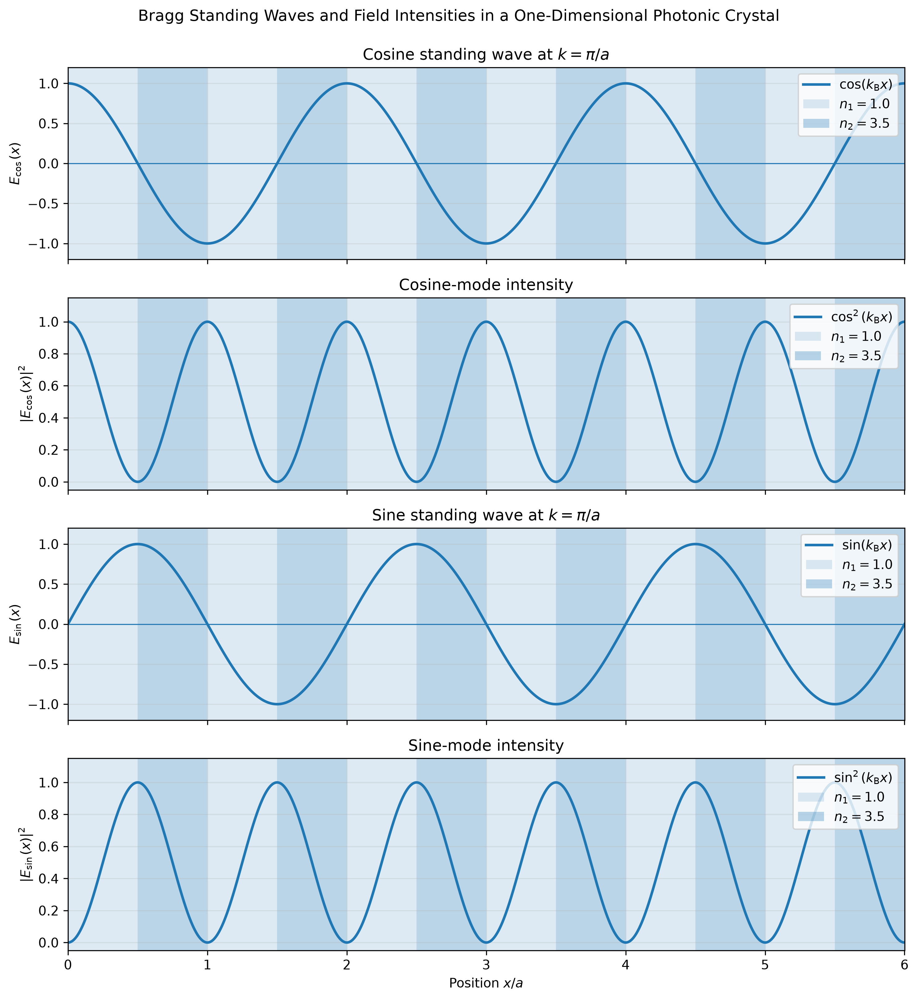
</p>

The figure compares the two standing-wave fields and their corresponding
intensity distributions against the periodic dielectric background.

### P04 — Transfer Matrix and Transmission Spectrum

Calculate the transmission spectrum of a finite one-dimensional photonic crystal
using the transfer-matrix method.

#### Parameters

- Material A refractive index: $n_1 = 1.0$
- Material B refractive index: $n_2 = 3.5$
- Lattice constant: $a = 1.0$
- Fill fraction: $0.5$
- Number of unit cells: $10$

#### Model

Within each homogeneous dielectric layer, the electric field is represented as
a superposition of right- and left-propagating waves:

```math
E(x) = A e^{iqx} + B e^{-iqx},
```

where

```math
q = \frac{n\omega}{c}.
```

Propagation through a layer of thickness $d$ is described by the propagation
matrix

```math
P(n,d,\omega) = \begin{pmatrix} e^{iqd} & 0 \\ 0 & e^{-iqd} \end{pmatrix}.
```

At an interface between two dielectric materials with refractive indices
$n_i$ and $n_j$, the wave amplitudes are related by an interface matrix.

Combining the propagation and interface matrices gives the transfer matrix of
one unit cell. Repeating the unit-cell matrix over multiple periods gives the
total transfer matrix of the finite photonic crystal:

```math
M_{\mathrm{total}} = M_{\mathrm{cell}}^N,
```

where $N$ is the number of unit cells.

For incidence and exit through the same surrounding medium, the power
transmission coefficient is calculated from the transmission amplitude $t$ as

```math
T = |t|^2.
```

#### Output

<p align="center">
  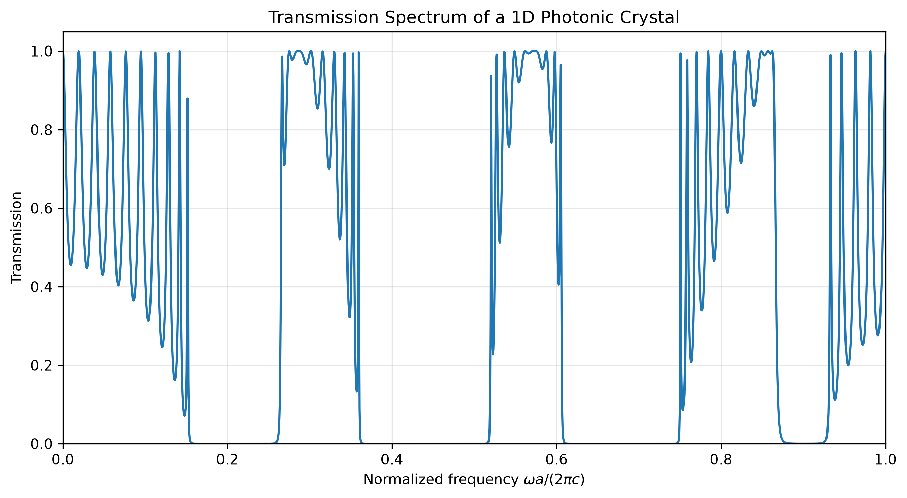
</p>

The transmission spectrum contains frequency intervals with high transmission
and intervals in which transmission is strongly suppressed. The low-transmission
regions indicate the formation of photonic stop bands in the finite periodic
structure.

### P05 — Allowed and Forbidden Frequency Bands

Use the transfer matrix of one unit cell to determine the allowed and forbidden
frequency regions of an infinite one-dimensional photonic crystal.

#### Parameters

- Material A refractive index: $n_1 = 1.0$
- Material B refractive index: $n_2 = 3.5$
- Lattice constant: $a = 1.0$
- Fill fraction: $0.5$

#### Model

According to Bloch's theorem, the field amplitudes in neighboring unit cells are
related by

```math
\begin{pmatrix} A(x+a) \\ B(x+a) \end{pmatrix} = e^{ika} \begin{pmatrix} A(x) \\ B(x) \end{pmatrix}.
```

Therefore, the Bloch factor $e^{ika}$ is an eigenvalue of the unit-cell transfer
matrix $M$.

For a lossless unit cell,

```math
\det(M) = 1,
```

and the eigenvalue equation gives the Bloch dispersion relation

```math
\cos(ka) = \frac{1}{2}\mathrm{Tr}(M).
```

Define the Bloch function

```math
F(\omega) = \frac{1}{2}\mathrm{Tr}(M).
```

When

```math
|F(\omega)| \leq 1,
```

a real Bloch wavevector exists, so the corresponding frequency belongs to an
allowed photonic band.

When

```math
|F(\omega)| > 1,
```

the Bloch wavevector becomes complex. The field then decays exponentially
through the crystal, and the corresponding frequency lies inside a forbidden
band or photonic band gap.

#### Output

<p align="center">
  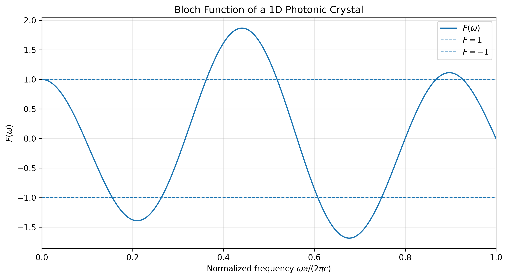
</p>

The Bloch function is compared with the boundaries $F=1$ and $F=-1$.
Frequencies for which the curve lies between these boundaries support real
Bloch wavevectors.

<p align="center">
  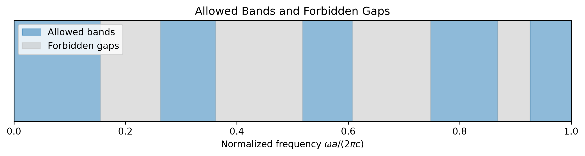
</p>

The second figure classifies the frequency axis into allowed and forbidden
regions using the condition $|F(\omega)| \leq 1$.

### P06 — Complex Bloch Wavevector

Calculate the real and imaginary parts of the Bloch wavevector across both
allowed and forbidden frequency regions.

#### Parameters

- Material A refractive index: $n_1 = 1.0$
- Material B refractive index: $n_2 = 3.5$
- Lattice constant: $a = 1.0$
- Fill fraction: $0.5$

#### Model

The Bloch wavevector is obtained from the dispersion relation

```math
\cos(ka) = F(\omega),
```

where

```math
F(\omega) = \frac{1}{2}\mathrm{Tr}(M).
```

It can therefore be written as

```math
k(\omega) = \frac{1}{a}\arccos\left[F(\omega)\right].
```

Inside an allowed band, $|F(\omega)|\leq 1$, so $k$ is real and the Bloch wave
propagates through the periodic structure.

Inside a forbidden band, $|F(\omega)|>1$, so $k$ becomes complex:

```math
k = k_{\mathrm{r}} + i k_{\mathrm{i}}.
```

The corresponding Bloch factor is

```math
e^{ikx} = e^{ik_{\mathrm{r}}x}e^{-k_{\mathrm{i}}x}.
```

The real part $k_{\mathrm{r}}$ describes the spatial phase variation, while the
imaginary part $k_{\mathrm{i}}$ gives the exponential attenuation rate inside
the photonic band gap.

#### Output

<p align="center">
  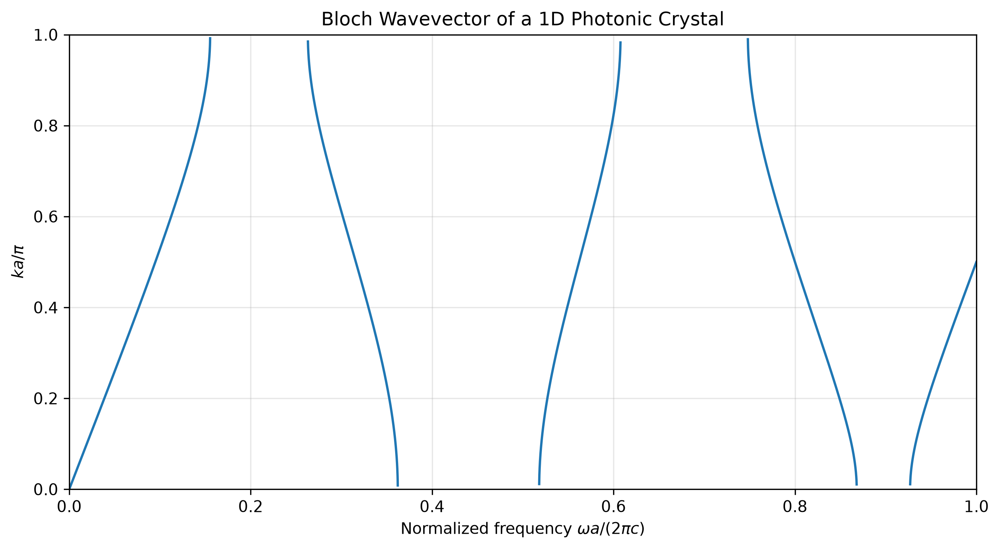
</p>

The real part of the Bloch wavevector varies across the allowed bands, while a
nonzero imaginary part appears inside the forbidden frequency regions. This
directly shows the transition from propagating Bloch waves to evanescent Bloch
waves.

### P07 — Photonic Band Structure

Construct the photonic band structure of the one-dimensional periodic dielectric
from the real Bloch wavevectors obtained in the allowed frequency regions.

#### Parameters

- Material A refractive index: $n_1 = 1.0$
- Material B refractive index: $n_2 = 3.5$
- Lattice constant: $a = 1.0$
- Fill fraction: $0.5$

#### Model

The photonic band structure represents the relationship between the allowed
frequencies and the corresponding real Bloch wavevectors.

For each normalized frequency, the unit-cell transfer matrix is constructed and
the Bloch relation

```math
\cos(ka) = \frac{1}{2}\mathrm{Tr}(M)
```

is evaluated.

Only frequencies satisfying

```math
\left| \frac{1}{2}\mathrm{Tr}(M) \right| \leq 1
```

are included because these frequencies produce real Bloch wavevectors.

The horizontal axis is the normalized Bloch wavevector

```math
\frac{ka}{\pi},
```

and the vertical axis is the normalized frequency

```math
\frac{\omega a}{2\pi c}.
```

The band structure is displayed along the one-dimensional high-symmetry path

```math
X \rightarrow \Gamma \rightarrow X,
```

where

```math
\Gamma: k=0
```

and

```math
X: k=\pm\frac{\pi}{a}.
```

#### Output

<p align="center">
  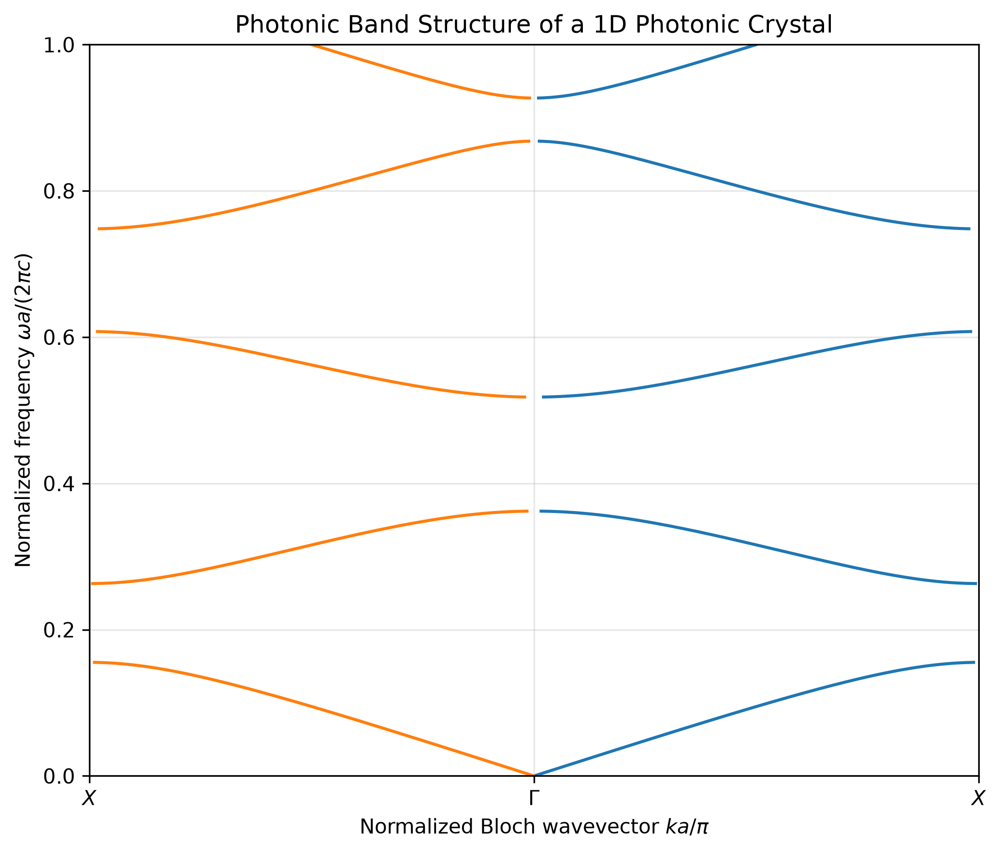
</p>

Each continuous branch represents an allowed photonic band. The empty frequency
intervals separating neighboring branches are photonic band gaps, in which no
real Bloch wavevector exists.

### P08 — Band-Gap Parameter Study

Investigate how the first photonic band gap of a one-dimensional periodic
dielectric depends on refractive-index contrast, fill fraction, and the number
of unit cells.

#### Base Parameters

- Material A refractive index: $n_1 = 1.0$
- Material B refractive index: $n_2 = 3.5$
- Lattice constant: $a = 1.0$
- Fill fraction: $f = d_1/a = 0.5$
- Number of unit cells: $N = 10$
- Incident-medium refractive index: $n_{\mathrm{incident}} = 1.0$
- Exit-medium refractive index: $n_{\mathrm{exit}} = 1.0$

#### Model

The first photonic band gap is identified from the unit-cell transfer matrix
using the Bloch condition

```math
\cos(ka) = \frac{1}{2}\mathrm{Tr}(M_{\mathrm{cell}}).
```

A normalized frequency belongs to a forbidden band when

```math
\left|
\frac{1}{2}\mathrm{Tr}(M_{\mathrm{cell}})
\right| > 1.
```

For each parameter value, the lower and upper edges of the first band gap are
extracted as

```math
\nu_{\mathrm{lower}},
\qquad
\nu_{\mathrm{upper}},
```

where

```math
\nu = \frac{\omega a}{2\pi c}.
```

The absolute band-gap width is

```math
\Delta\nu =\nu_{\mathrm{upper}} - \nu_{\mathrm{lower}},
```

and the relative band-gap width is

```math
\frac{\Delta\nu}{\nu_{\mathrm{mid}}},
\qquad
\nu_{\mathrm{mid}}
=
\frac{
\nu_{\mathrm{lower}}
+
\nu_{\mathrm{upper}}
}{2}.
```

Three parameter studies are performed.

#### Refractive-Index Contrast

The refractive index of material B is varied over

```math
n_2 = 1.5,\ 2.0,\ 2.5,\ 3.5,\ 4.5,
```

while the physical fill fraction remains fixed.

Increasing the refractive-index contrast shifts the first band gap toward lower
normalized frequencies. The absolute gap width is non-monotonic because both
the refractive-index contrast and the optical thickness of the second layer
change simultaneously. In contrast, the relative gap width increases with
refractive-index contrast.

For example, increasing $n_2$ from $1.5$ to $4.5$ shifts the first band-gap
center from approximately $0.399$ to $0.166$, while the relative gap width
increases from approximately $0.243$ to $0.541$.

<p align="center">
  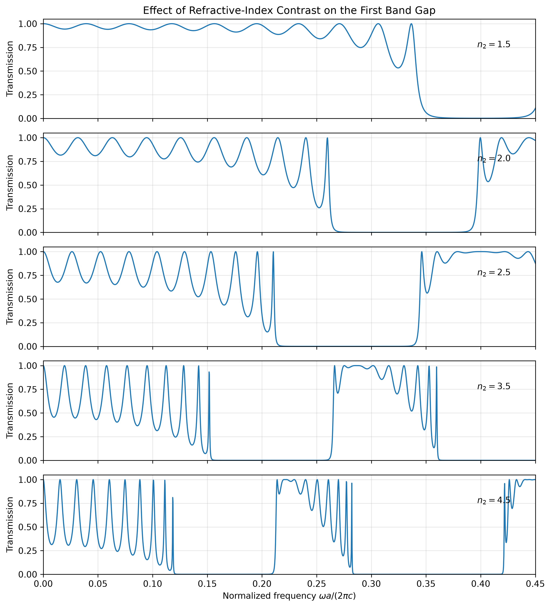
</p>

<p align="center">
  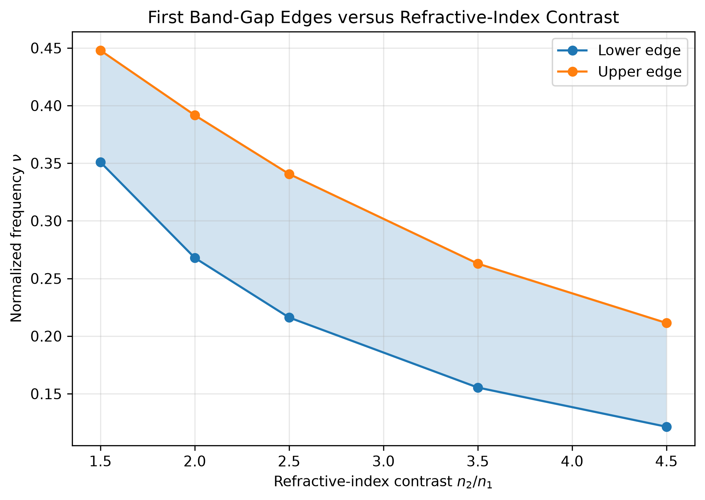
</p>

<p align="center">
  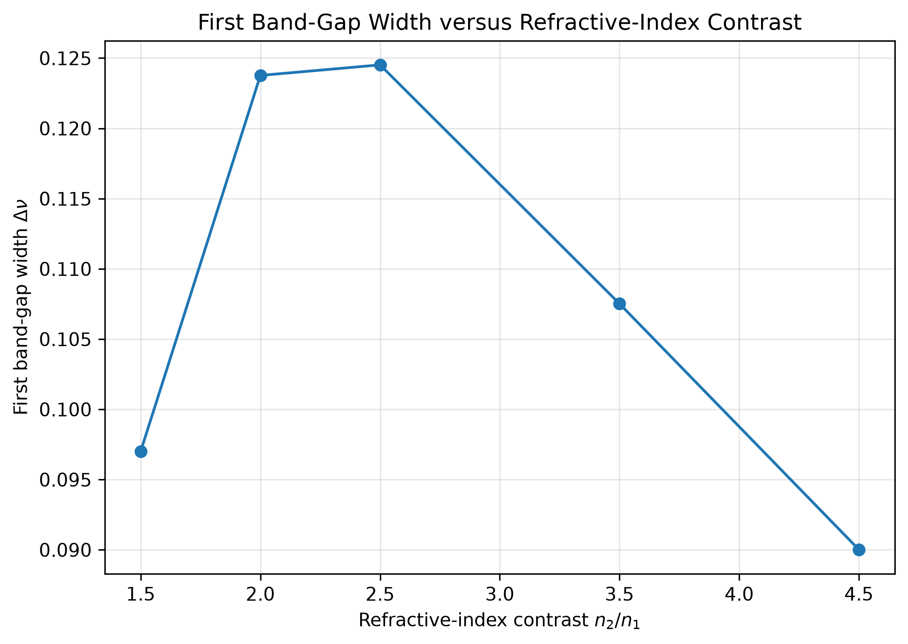
</p>

<p align="center">
  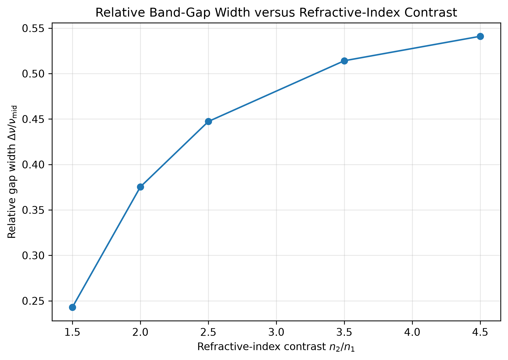
</p>

#### Fill Fraction

The fill fraction

```math
f = \frac{d_1}{a}
```

is varied while maintaining

```math
d_1 = fa,
\qquad
d_2 = (1-f)a.
```

The relative band-gap width reaches a maximum near $f \approx 0.8$. This agrees
with the equal-optical-thickness condition

```math
n_1d_1 = n_2d_2,
```

which predicts

```math
f_{\mathrm{opt}}
=
\frac{n_2}{n_1+n_2}
=
\frac{3.5}{4.5}
\approx 0.778.
```

As the fill fraction approaches either extreme, one dielectric layer becomes
very thin and the periodic modulation weakens.

The relative gap width increases from approximately $0.093$ at $f=0.10$ to a
maximum of approximately $0.745$ near $f=0.80$, before decreasing as
$f$ approaches $1$.

<p align="center">
  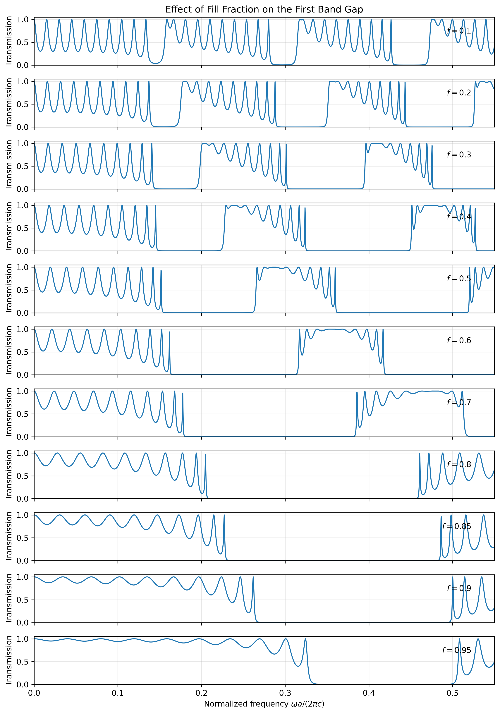
</p>

<p align="center">
  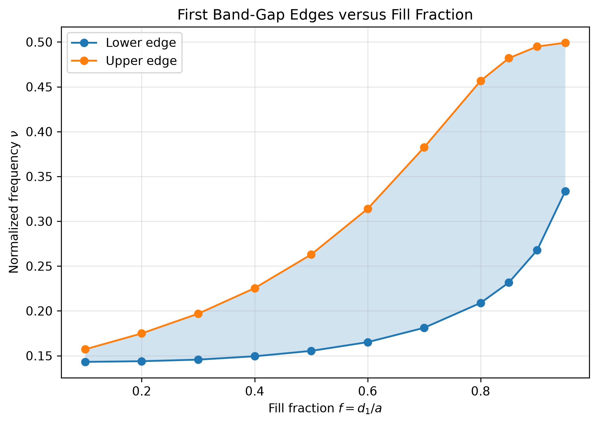
</p>

<p align="center">
  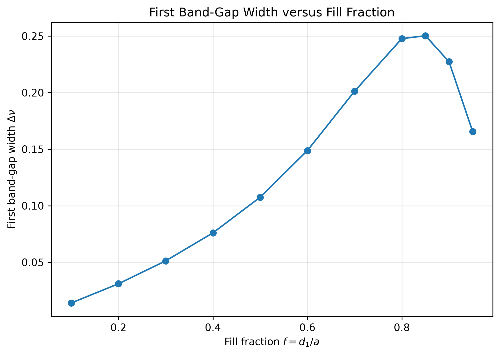
</p>

<p align="center">
  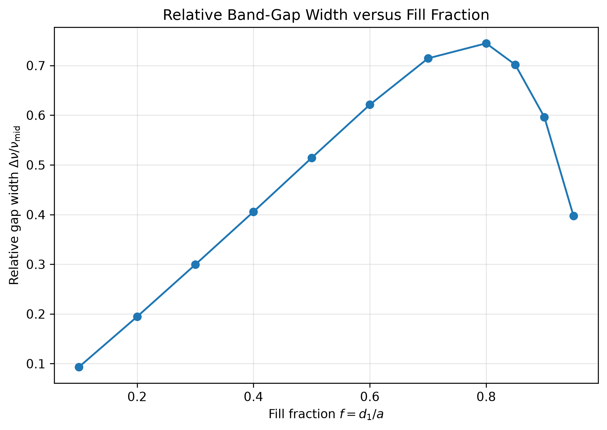
</p>

#### Number of Unit Cells

The number of unit cells is varied over

```math
N = 2,\ 4,\ 6,\ 10,\ 20.
```

Changing $N$ does not alter the theoretical band-gap boundaries because the
unit-cell structure remains unchanged. Instead, increasing $N$ strengthens the
suppression of transmission inside the band gap and makes the band edges
sharper.

The transmission at the center of the first band gap decreases approximately
exponentially with crystal length:

```math
T(N) \propto e^{-2\kappa Na},
```

where $\kappa$ is the imaginary part of the Bloch wavevector inside the gap.

At the center of the first band gap, the transmission decreases from
approximately $8.26\times10^{-2}$ for $N=2$ to
$3.43\times10^{-15}$ for $N=20$.

<p align="center">
  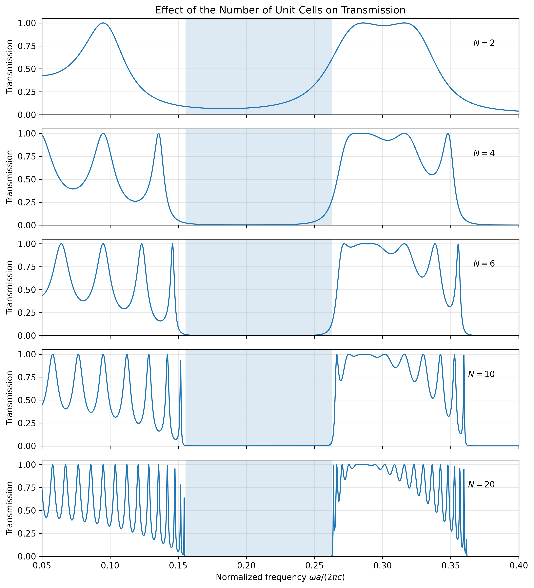
</p>

<p align="center">
  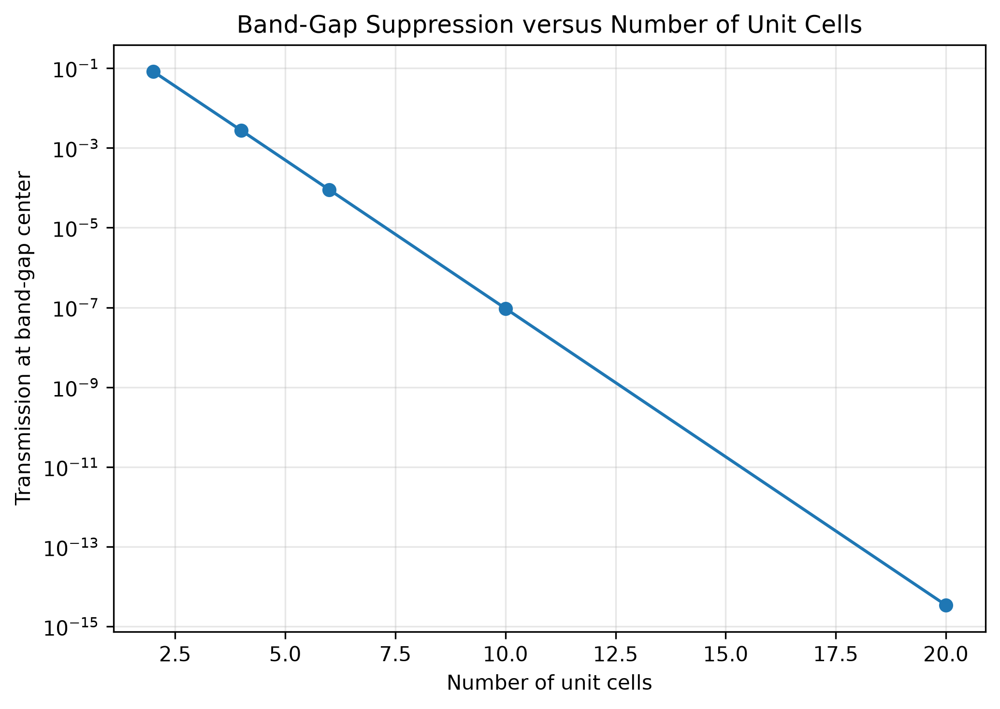
</p>

The results distinguish changes to the intrinsic band structure from
finite-size effects. Refractive-index contrast and fill fraction modify the
unit cell and therefore change the band gap itself, whereas the number of unit
cells controls how strongly a finite crystal suppresses transmission within
that gap.

### P09 — One-Dimensional Band-Edge Field Profiles

Locate the edges of the first photonic band gap and visualize the corresponding
electric-field intensity profiles in the one-dimensional periodic dielectric.

#### Parameters

- Material A refractive index: $n_1 = 1.0$
- Material B refractive index: $n_2 = 3.5$
- Lattice constant: $a = 1.0$
- Fill fraction: $0.5$
- Number of displayed unit cells: $6$

#### Model

The first photonic band gap is located using the Bloch function

```math
F(\nu)
=
\frac{1}{2}
\mathrm{Tr}
\left(
M_{\mathrm{cell}}
\right),
```

where the normalized frequency is

```math
\nu
=
\frac{\omega a}{2\pi c}.
```

The lower and upper band-edge frequencies satisfy

```math
\left|F(\nu)\right|=1.
```

For the selected dielectric structure, the first band-gap edges are approximately

```math
\nu_{\mathrm{lower}}
\approx 0.155319,
```

and

```math
\nu_{\mathrm{upper}}
\approx 0.263047.
```

At a band edge, the Bloch eigenvalue is either $+1$ or $-1$, so the
electromagnetic state satisfies

```math
M_{\mathrm{cell}}\mathbf{v}
=
\lambda\mathbf{v},
\qquad
\lambda=\pm1.
```

The electric field inside each homogeneous layer is reconstructed as a
superposition of forward- and backward-propagating waves:

```math
E(x) = E_{+}e^{iqx} + E_{-}e^{-iqx},
```

where

```math
q = \frac{n\omega}{c}.
```

The normalized electric-field intensity is then calculated from

```math
I(x)
=
\frac{|E(x)|^2}
{\max |E(x)|^2}.
```

The two band-edge modes form different standing-wave patterns.

The lower-frequency mode is concentrated mainly in the high-index regions,
where the relative permittivity

```math
\varepsilon_r=n^2
```

is larger.

The upper-frequency mode is concentrated mainly in the low-index regions,
where the relative permittivity is smaller.

Because the two modes overlap differently with the dielectric structure, they
acquire different eigenfrequencies. This frequency splitting separates the
lower and upper photonic bands and produces the photonic band gap.

#### Output

<p align="center">
  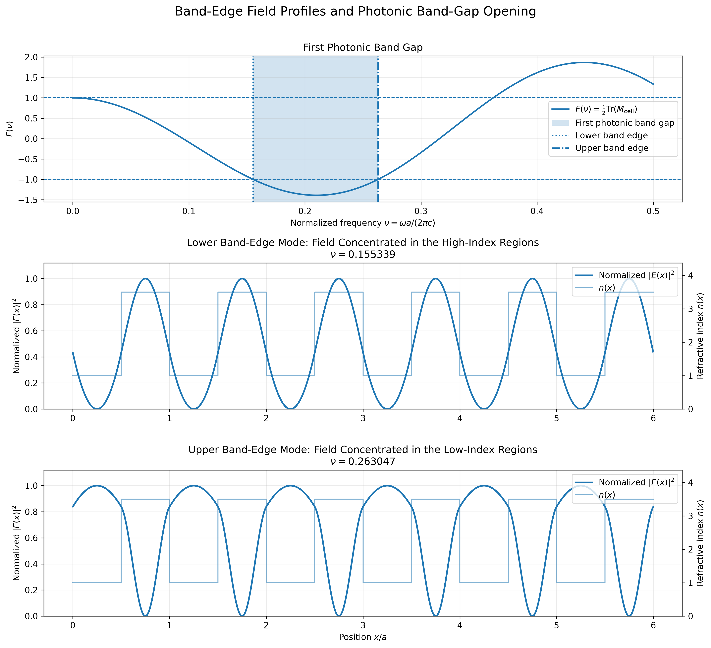
</p>

The upper panel identifies the first photonic band gap from the condition
$|F(\nu)|>1$ and marks its lower and upper frequency edges.

The middle panel shows the lower band-edge mode, whose electric-field intensity
is concentrated primarily in the high-index layers.

The lower panel shows the upper band-edge mode, whose electric-field intensity
is concentrated primarily in the low-index layers.

These spatial field profiles provide a direct visualization of the band-gap
opening caused by Bragg coupling and dielectric-frequency splitting.

The physical mechanism can be summarized as

```math
\text{different spatial localization}
\rightarrow
\text{different eigenfrequencies}
\rightarrow
\text{photonic band-gap opening}.
```

### P10 — One-Dimensional Defect Mode

Introduce a central defect layer into a finite one-dimensional photonic crystal
and calculate the resulting transmission spectrum and spatial field profile.

#### Parameters

- Material A refractive index: $n_1 = 1.0$
- Material B refractive index: $n_2 = 3.5$
- Incident-medium refractive index: $n_{\mathrm{in}} = 1.0$
- Exit-medium refractive index: $n_{\mathrm{out}} = 1.0$
- Lattice constant: $a = 1.0$
- Fill fraction: $0.5$
- Number of Bragg-mirror cells on each side: $N = 6$
- Defect refractive index: $n_{\mathrm{d}} = 1.0$
- Defect thickness: $d_{\mathrm{d}} = a$

#### Structure

The perfect reference crystal is constructed as

```math
(AB)^{2N},
```

while the defect crystal has the symmetric structure

```math
(AB)^N D(BA)^N.
```

The central defect layer breaks the translational symmetry of the periodic
crystal and introduces a localized electromagnetic mode inside the first
photonic band gap.

#### Model

The field-state transfer matrix is used to propagate the electromagnetic state

```math
\begin{pmatrix} E \\ H \end{pmatrix}
```

through the complete multilayer structure.

The transmission amplitude is obtained by matching the incident, reflected,
and transmitted waves at the external boundaries. The power transmission is

```math
T = \frac{n_{\mathrm{out}}}{n_{\mathrm{in}}} |t|^2.
```

The transmission spectra of the perfect and defect crystals are compared over
the same frequency range. The defect-mode frequency is identified as the
maximum-transmission point located inside the first photonic band gap.

At this resonant frequency, the electric field is reconstructed throughout the
multilayer structure. The normalized field intensity is calculated as

```math
\frac{|E(x)|^2}
{\max |E(x)|^2}.
```

#### Output

<p align="center">
  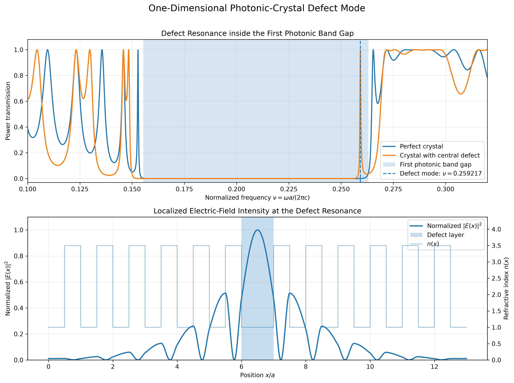
</p>

The perfect crystal strongly suppresses transmission inside the photonic band
gap. Introducing the central defect produces a narrow transmission resonance
within the gap.

The corresponding electric-field intensity is concentrated near the defect
layer and decays into the surrounding periodic Bragg mirrors. This spatial
localization demonstrates the formation of a one-dimensional photonic-crystal
defect cavity.

### P11 — Two-Dimensional Periodic Dielectric

Construct and visualize a two-dimensional square lattice of dielectric rods
embedded in an air background.

#### Parameters

- Background refractive index: $n_{\mathrm{bg}} = 1.0$
- Rod refractive index: $n_{\mathrm{rod}} = 3.5$
- Lattice constant: $a = 1.0$
- Rod radius: $r = 0.2a$
- Number of unit cells: $6 \times 6$

#### Model

Identical circular dielectric rods are placed at the center of each unit cell
of a two-dimensional square lattice. The refractive-index distribution is
periodic along both the $x$- and $y$-directions:

```math
n(x + a, y) = n(x, y),
```

```math
n(x, y + a) = n(x, y).
```

A point $(x,y)$ lies inside a rod centered at $(x_c,y_c)$ when

```math
(x-x_c)^2 + (y-y_c)^2 \leq r^2.
```

The relative permittivity is obtained from

```math
\varepsilon_r(x,y) = n^2(x,y).
```

#### Output

<p align="center">
  
</p>

The resulting structure serves as the real-space geometric foundation for
two-dimensional reciprocal-lattice, Brillouin-zone, and photonic-band
calculations.

### P12 — Reciprocal Lattice and Brillouin Zone

Construct and visualize the reciprocal lattice and first Brillouin zone of a
two-dimensional square lattice.

#### Parameters

- Lattice constant: $a = 1.0$
- Real-space lattice vectors:

  ```math
  \mathbf{a}_1 =
  \begin{pmatrix}
  a \\
  0
  \end{pmatrix},
  \qquad
  \mathbf{a}_2 =
  \begin{pmatrix}
  0 \\
  a
  \end{pmatrix}
  ```

- Reciprocal-lattice index range: $-2 \leq m,n \leq 2$

#### Model

The reciprocal-lattice basis vectors are calculated from the real-space lattice
vectors using

```math
\mathbf{a}_i \cdot \mathbf{b}_j = 2\pi\delta_{ij}.
```

For the square lattice,

```math
\mathbf{b}_1 = \begin{pmatrix}2\pi/a \\0\end{pmatrix},
\qquad\mathbf{b}_2 = \begin{pmatrix}0 \\2\pi/a\end{pmatrix}.
```

The reciprocal-lattice points are generated from

```math
\mathbf{G} = m\mathbf{b}_1 + n\mathbf{b}_2, \qquad m,n\in\mathbb{Z}.
```

The first Brillouin zone is the square region

```math
-\frac{\pi}{a} \leqk_x \leq \frac{\pi}{a},
\qquad
-\frac{\pi}{a} \leqk_y \leq \frac{\pi}{a}.
```

The standard high-symmetry points are

```math
\Gamma=(0,0),
\qquad
X=\left(\frac{\pi}{a},0\right),
\qquad
M=\left(\frac{\pi}{a},\frac{\pi}{a}\right).
```

The path

```math
\Gamma
\rightarrow
X
\rightarrow
M
\rightarrow
\Gamma
```

is displayed as the standard wavevector path used in subsequent
two-dimensional photonic band-structure calculations.

#### Implementation

Reusable utilities are organized into separate modules:

- `reciprocal_lattice_utils.py`
  - calculates reciprocal-lattice basis vectors;
  - generates reciprocal-lattice points;
  - constructs the square first Brillouin zone;
  - defines the $\Gamma$, $X$, and $M$ high-symmetry points.

- `plotting_utils.py`
  - visualizes the reciprocal lattice and reciprocal basis vectors;
  - plots the first Brillouin zone and the
    $\Gamma\rightarrow X\rightarrow M\rightarrow\Gamma$ path.

#### Output

<p align="center">
  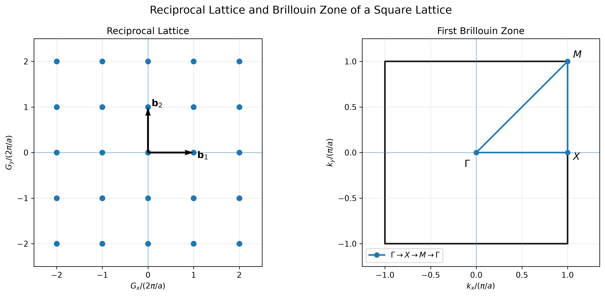
</p>

This reciprocal-space construction provides the geometric foundation for
generating discrete wavevector paths and calculating two-dimensional photonic
band structures using the plane-wave expansion method.

### P13 — Fourier Coefficients of the Dielectric Functions

Calculate and visualize the reciprocal-space Fourier coefficients of the
dielectric function and inverse dielectric function for a two-dimensional
square lattice of circular dielectric rods.

#### Parameters

- Background refractive index: $n_{\mathrm{bg}} = 1.0$
- Rod refractive index: $n_{\mathrm{rod}} = 3.5$
- Lattice constant: $a = 1.0$
- Rod radius: $r = 0.2a$
- Reciprocal-lattice index limit: $-5 \leq m,n \leq 5$

#### Model

The dielectric structure consists of circular dielectric rods embedded in a
uniform background. The corresponding permittivities are

```math
\varepsilon_{\mathrm{rod}} = n_{\mathrm{rod}}^2,
\qquad
\varepsilon_{\mathrm{bg}} = n_{\mathrm{bg}}^2.
```

The dielectric function is expanded in reciprocal space as

```math
\varepsilon(\mathbf r)
=
\sum_{\mathbf G}
\varepsilon_{\mathbf G}
e^{i\mathbf G\cdot\mathbf r},
```

where the Fourier coefficients are

```math
\varepsilon_{\mathbf G}
=
\frac{1}{A_{\mathrm{cell}}}
\int_{\mathrm{cell}}
\varepsilon(\mathbf r)
e^{-i\mathbf G\cdot\mathbf r}
\,d^2r.
```

For circular rods centered in the unit cell, the nonzero reciprocal-space
coefficients are determined analytically using the circular form factor

```math
\frac{2J_1(|\mathbf G|r)}{|\mathbf G|r},
```

where $J_1$ is the first-order Bessel function of the first kind.

The same procedure is also applied to the inverse dielectric function,

```math
\eta(\mathbf r) = \frac{1}{\varepsilon(\mathbf r)},
```

to obtain the coefficients

```math
\eta_{\mathbf G} = \left(\frac{1}{\varepsilon}\right)_{\mathbf G}.
```

These inverse-dielectric coefficients are required when constructing the
plane-wave expansion matrices for two-dimensional photonic crystals.

#### Zero-Order Coefficients

The filling fraction of the dielectric rods is

```math
f = \frac{\pi r^2}{a^2} = 0.125664.
```

The calculated zero-order coefficients are

```math
\varepsilon_{\mathbf 0}
=
(1-f)\varepsilon_{\mathrm{bg}}
+
f\varepsilon_{\mathrm{rod}}
=
2.413717,
```

and

```math
\left(\frac{1}{\varepsilon}\right)_{\mathbf 0}
=
\frac{1-f}{\varepsilon_{\mathrm{bg}}}
+
\frac{f}{\varepsilon_{\mathrm{rod}}}
=
0.884595.
```

The zero-order inverse-dielectric coefficient is generally not equal to the
inverse of the zero-order dielectric coefficient:

```math
\left(\frac{1}{\varepsilon}\right)_{\mathbf 0}
\neq
\frac{1}{\varepsilon_{\mathbf 0}}.
```

#### Output

<p align="center">
  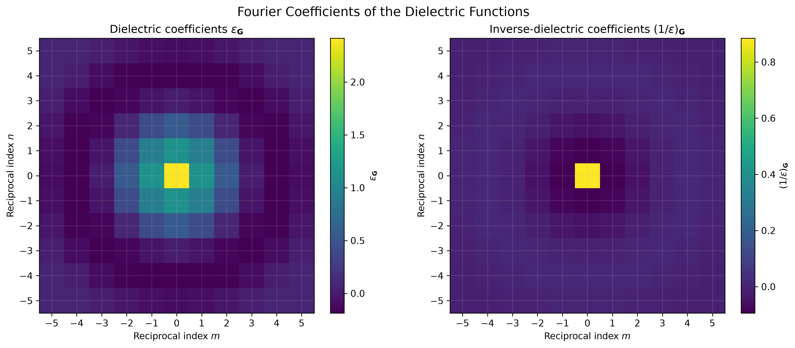
</p>

The left panel shows the Fourier coefficients
$\varepsilon_{\mathbf G}$, while the right panel shows the coefficients
$(1/\varepsilon)_{\mathbf G}$. The coefficients are largest near
$\mathbf G=\mathbf 0$ and generally decrease in magnitude for larger
reciprocal-lattice vectors.

The approximately radial coefficient pattern reflects the circular symmetry
of the dielectric rods. These coefficients provide the reciprocal-space
material representation used in the subsequent plane-wave expansion
calculation.

### P14 — Two-Dimensional TE and TM Band Structures

Calculate and visualize the TE and TM photonic band structures of a
two-dimensional square lattice of circular dielectric rods using the
plane-wave expansion method.

#### Parameters

- Background refractive index: $n_{\mathrm{bg}} = 1.0$
- Rod refractive index: $n_{\mathrm{rod}} = 3.5$
- Background relative permittivity:

```math
\varepsilon_{\mathrm{bg}} = n_{\mathrm{bg}}^2 = 1.0
```

- Rod relative permittivity:

```math
\varepsilon_{\mathrm{rod}} = n_{\mathrm{rod}}^2 = 12.25
```

- Lattice constant: $a = 1.0$
- Rod radius: $r = 0.2a$
- Reciprocal-lattice index limit: $N = 3$
- Number of plane waves:

```math
N_G = (2N+1)^2 = 49
```

- Wavevector path: $\Gamma \rightarrow X \rightarrow M \rightarrow \Gamma$
- Number of sampled points per path segment: $30$
- Number of plotted bands: $8$

#### Plane-Wave Basis

The electromagnetic fields are expanded in reciprocal-space plane waves
labelled by reciprocal-lattice vectors

```math
\mathbf{G} = m\mathbf{b}_1 + n\mathbf{b}_2,
```

where

```math
-N \leq m,n \leq N.
```

For each Bloch wavevector $\mathbf{k}$, the field is represented using plane-wave
components with wavevectors

```math
\mathbf{k}+\mathbf{G}.
```

The reciprocal-space basis is truncated to a finite set so that the Maxwell
eigenvalue equations can be represented numerically as finite matrices.

#### Dielectric Convolution Matrices

The Fourier coefficients calculated in P13 are used to construct the material
convolution matrices

```math
B_{\mathbf{G},\mathbf{G}'}
=
\varepsilon_{\mathbf{G}-\mathbf{G}'}
```

and

```math
\eta_{\mathbf{G},\mathbf{G}'}
=
\left(\frac{1}{\varepsilon}\right)_{\mathbf{G}-\mathbf{G}'}.
```

The dependence on $\mathbf{G}-\mathbf{G}'$ describes the coupling between
different plane-wave components produced by the periodic dielectric structure.

#### TE Polarization

For TE polarization, the nonzero out-of-plane field component is $H_z$.

The plane-wave eigenvalue equation is

```math
\sum_{\mathbf{G}'}
(\mathbf{k}+\mathbf{G})
\cdot
(\mathbf{k}+\mathbf{G}')
\left(\frac{1}{\varepsilon}\right)_{\mathbf{G}-\mathbf{G}'}
H_{\mathbf{G}'}
=
\frac{\omega^2}{c^2}
H_{\mathbf{G}}.
```

The TE matrix elements are therefore

```math
A^{\mathrm{TE}}_{\mathbf{G},\mathbf{G}'}
=
(\mathbf{k}+\mathbf{G})
\cdot
(\mathbf{k}+\mathbf{G}')
\left(\frac{1}{\varepsilon}\right)_{\mathbf{G}-\mathbf{G}'}.
```

This produces the standard Hermitian eigenvalue problem

```math
A^{\mathrm{TE}}\mathbf{H}
=
\frac{\omega^2}{c^2}\mathbf{H}.
```

#### TM Polarization

For TM polarization, the nonzero out-of-plane field component is $E_z$.

The plane-wave equation is

```math
|\mathbf{k}+\mathbf{G}|^2 E_{\mathbf{G}}
=
\frac{\omega^2}{c^2}
\sum_{\mathbf{G}'}
\varepsilon_{\mathbf{G}-\mathbf{G}'}
E_{\mathbf{G}'}.
```

This is written as the generalized eigenvalue problem

```math
A^{\mathrm{TM}}\mathbf{E}
=
\frac{\omega^2}{c^2}
B^{\mathrm{TM}}\mathbf{E},
```

where

```math
A^{\mathrm{TM}}_{\mathbf{G},\mathbf{G}'}
=
|\mathbf{k}+\mathbf{G}|^2
\delta_{\mathbf{G},\mathbf{G}'}
```

and

```math
B^{\mathrm{TM}}_{\mathbf{G},\mathbf{G}'}
=
\varepsilon_{\mathbf{G}-\mathbf{G}'}.
```

#### High-Symmetry Path

The band structure is evaluated along the standard irreducible Brillouin-zone
path for a square lattice:

```math
\Gamma \rightarrow X \rightarrow M \rightarrow \Gamma,
```

with

```math
\Gamma=(0,0),
```

```math
X=\left(\frac{\pi}{a},0\right),
```

and

```math
M=\left(\frac{\pi}{a},\frac{\pi}{a}\right).
```

This path samples the boundary and diagonal directions of the first Brillouin
zone while taking advantage of the rotational and reflection symmetries of the
square lattice.

#### Normalized Frequency

The eigenvalues correspond to

```math
\lambda=\frac{\omega^2}{c^2}.
```

They are converted to the dimensionless normalized frequency

```math
\frac{\omega a}{2\pi c}.
```

Using normalized frequency makes the calculated band structure independent of
the absolute physical scale of the lattice.

#### Output

<p align="center">
  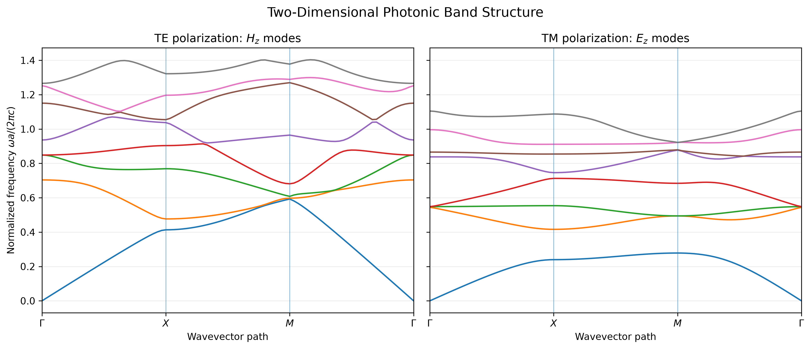
</p>

The left panel shows the TE bands associated with the $H_z$ field component,
while the right panel shows the TM bands associated with the $E_z$ field
component.

The lowest band begins at zero frequency at the $\Gamma$ point, as expected for
long-wavelength electromagnetic modes. The TE and TM band structures differ
because their eigenvalue matrices depend differently on the dielectric function.

Degenerate or nearly degenerate eigenfrequencies can appear at high-symmetry
points because multiple electromagnetic modes may be related by the symmetry of
the square lattice.

This module combines the reciprocal-lattice construction from P12 and the
dielectric Fourier coefficients from P13 to produce the first complete
two-dimensional photonic-band calculation in the project.

### P15 — Complete Photonic Band-Gap Search

Analyze the calculated TE and TM photonic band structures and identify
frequency intervals in which neither polarization supports a propagating mode.

#### Parameters

- Background refractive index: $n_{\mathrm{bg}} = 1.0$
- Rod refractive index: $n_{\mathrm{rod}} = 3.5$
- Lattice constant: $a = 1.0$
- Rod radius: $r = 0.2a$
- Reciprocal-lattice index limit: $N = 3$
- Number of plane waves:

```math
N_G = (2N+1)^2 = 49
```

- Wavevector path:

```math
\Gamma
\rightarrow
X
\rightarrow
M
\rightarrow
\Gamma
```

- Number of sampled points per path segment: $30$
- Number of calculated bands: $8$

#### Band-Gap Identification

For each polarization, a band gap between neighboring bands $n$ and $n+1$
exists when the minimum frequency of the upper band lies above the maximum
frequency of the lower band:

```math
\min_{\mathbf{k}}
\omega_{n+1}(\mathbf{k})
>
\max_{\mathbf{k}}
\omega_n(\mathbf{k}).
```

The lower and upper band-gap boundaries are therefore

```math
\omega_{\mathrm{lower}}
=
\max_{\mathbf{k}}
\omega_n(\mathbf{k}),
```

and

```math
\omega_{\mathrm{upper}}
=
\min_{\mathbf{k}}
\omega_{n+1}(\mathbf{k}).
```

The band-gap width is

```math
\Delta\omega
=
\omega_{\mathrm{upper}}
-
\omega_{\mathrm{lower}}.
```

The midgap frequency is

```math
\omega_{\mathrm{mid}}
=
\frac{
\omega_{\mathrm{lower}}
+
\omega_{\mathrm{upper}}
}{2},
```

and the relative gap width is measured by the gap-to-midgap ratio

```math
\frac{\Delta\omega}{\omega_{\mathrm{mid}}}.
```

#### Complete Photonic Band Gap

A complete photonic band gap must be forbidden for both TE and TM
polarizations.

If a TE gap occupies the interval

```math
[
\omega_{\mathrm{TE,lower}},
\omega_{\mathrm{TE,upper}}
],
```

and a TM gap occupies

```math
[
\omega_{\mathrm{TM,lower}},
\omega_{\mathrm{TM,upper}}
],
```

their common forbidden interval is

```math
\omega_{\mathrm{complete,lower}}
=
\max
\left(
\omega_{\mathrm{TE,lower}},
\omega_{\mathrm{TM,lower}}
\right),
```

```math
\omega_{\mathrm{complete,upper}}
=
\min
\left(
\omega_{\mathrm{TE,upper}},
\omega_{\mathrm{TM,upper}}
\right).
```

A complete band gap exists only when

```math
\omega_{\mathrm{complete,upper}}
>
\omega_{\mathrm{complete,lower}}.
```

#### Calculated TE Band Gap

For the selected structure, one TE band gap is detected between bands 4 and 5:

```math
0.913730
<
\frac{\omega a}{2\pi c}
<
0.918983.
```

Its width is

```math
\Delta\omega_{\mathrm{TE}}
=
0.005254,
```

with a midgap frequency of approximately

```math
\omega_{\mathrm{mid,TE}}
=
0.916357,
```

and a gap-to-midgap ratio of approximately

```math
0.573\%.
```

#### Calculated TM Band Gaps

Three TM band gaps are detected.

Between bands 1 and 2:

```math
0.278188
<
\frac{\omega a}{2\pi c}
<
0.415995,
```

with a gap width of

```math
0.137807
```

and a gap-to-midgap ratio of approximately

```math
39.703\%.
```

Between bands 4 and 5:

```math
0.712621
<
\frac{\omega a}{2\pi c}
<
0.745993,
```

with a gap width of

```math
0.033372
```

and a gap-to-midgap ratio of approximately

```math
4.576\%.
```

Between bands 6 and 7:

```math
0.879116
<
\frac{\omega a}{2\pi c}
<
0.910997,
```

with a gap width of

```math
0.031882
```

and a gap-to-midgap ratio of approximately

```math
3.562\%.
```

#### Complete-Gap Result

No overlapping TE–TM band gap is found for the selected structure.

The closest pair consists of the highest calculated TM gap,

```math
0.879116
<
\frac{\omega a}{2\pi c}
<
0.910997,
```

and the TE gap,

```math
0.913730
<
\frac{\omega a}{2\pi c}
<
0.918983.
```

These intervals are separated by

```math
0.913730 - 0.910997
=
0.002733,
```

so they do not form a complete photonic band gap.

This result shows that the square lattice of dielectric rods supports several
polarization-dependent band gaps, particularly a wide low-frequency TM gap,
but does not produce a polarization-independent forbidden interval for the
selected material and geometric parameters.

#### Output

<p align="center">
  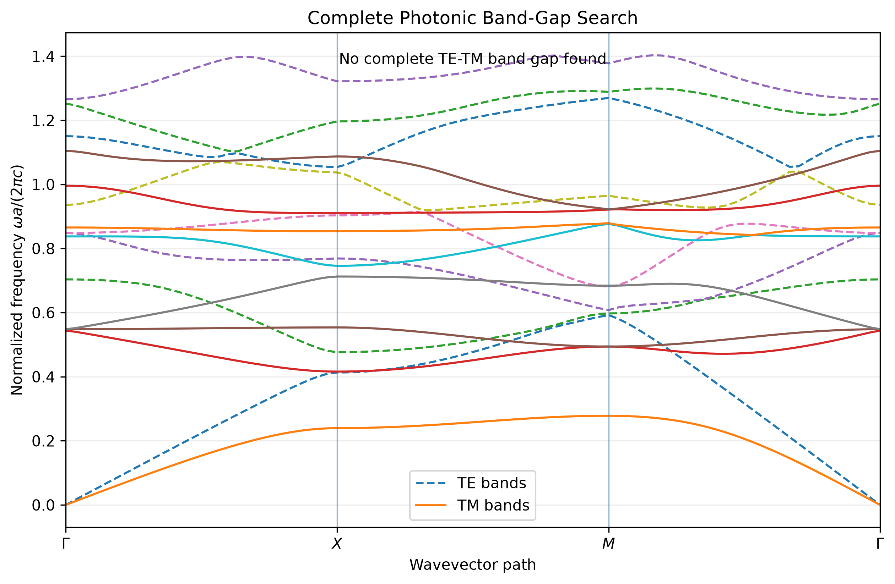
</p>

The dashed curves represent the TE bands and the solid curves represent the TM
bands.

Because no complete TE–TM band gap is found, no common forbidden-frequency
region is shaded. The figure instead reports that the selected structure does
not contain a complete photonic band gap along the sampled high-symmetry path.

The search is performed over the calculated

```math
\Gamma
\rightarrow
X
\rightarrow
M
\rightarrow
\Gamma
```

path. A stricter verification over the entire irreducible Brillouin zone would
require a two-dimensional wavevector-grid calculation.

## Project Structure

```text
computational-photonic-crystals/
├── scripts/
│   ├── p01_periodic_dielectric.py
│   ├── p02_bloch_wave_visualization.py
│   ├── p03_bragg_standing_waves.py
│   ├── p04_transfer_matrix.py
│   ├── p05_bloch_band_structure.py
│   ├── p06_bloch_wavevector.py
│   ├── p07_photonic_band_structure.py
│   ├── p08_band_gap_parameter_study.py
│   ├── p09_band_edge_field_profiles.py
│   ├── p10_1d_defect_mode.py
│   ├── p11_2d_dielectric_structure.py
│   ├── p12_reciprocal_lattice_brillouin_zone.py
│   ├── p13_fourier_coefficients.py
│   ├── p14_2d_te_tm_band_structure.py
│   └── p15_complete_band_gap_search.py
├── utils/
│   ├── __init__.py
│   ├── bloch_utils.py
│   ├── defect_utils.py
│   ├── field_profile_utils.py
│   ├── field_transfer_utils.py
│   ├── transfer_matrix_utils.py
│   ├── transmission_utils.py
│   ├── reciprocal_lattice_utils.py
│   ├── fourier_utils.py
│   ├── plotting_utils.py
│   ├── plane_wave_expansion_utils.py
│   └── band_gap_utils.py
├── figures/
│   ├── p01_periodic_dielectric.png
│   ├── p02_bloch_wave_visualization.png
│   ├── p02_bloch_translation_verification.png
│   ├── p03_bragg_standing_waves.png
│   ├── p04_transmission_spectrum.png
│   ├── p05_bloch_function.png
│   ├── p05_allowed_forbidden_bands.png
│   ├── p06_bloch_wavevector.png
│   ├── p07_photonic_band_structure.png
│   ├── p08_cell_number_gap_suppression.png
│   ├── p08_cell_number_transmission.png
│   ├── p08_fill_fraction_gap_edges.png
│   ├── p08_fill_fraction_gap_width.png
│   ├── p08_fill_fraction_relative_gap_width.png
│   ├── p08_fill_fraction_transmission.png
│   ├── p08_index_contrast_gap_edges.png
│   ├── p08_index_contrast_gap_width.png
│   ├── p08_index_contrast_relative_gap_width.png
│   ├── p08_index_contrast_transmission.png
│   ├── p09_band_edge_field_profiles.png
│   ├── p10_1d_defect_mode.png
│   ├── p11_2d_dielectric_structure.png
│   ├── p12_reciprocal_lattice_brillouin_zone.png
│   ├── p13_fourier_coefficients.png
│   ├── p14_2d_te_tm_band_structure.png
│   └── p15_complete_band_gap_search.png
├── requirements.txt
├── .gitignore
└── README.md
```

## Status

The project currently includes a detailed one-dimensional photonic-crystal
framework, covering periodic dielectric structures, Bloch waves, Bragg standing
waves, transfer-matrix analysis, allowed and forbidden frequency bands, complex
Bloch wavevectors, photonic band structures, parameter-dependent band-gap
behavior, band-edge electric-field profiles, and localized defect modes.

The one-dimensional calculations connect several complementary descriptions of
photonic crystals. The transfer-matrix method describes propagation and
transmission through finite multilayer structures, while Bloch analysis
identifies the allowed bands and photonic band gaps of the corresponding
infinite periodic system.

The band-edge field calculations show that the lower- and upper-frequency modes
are concentrated in different dielectric regions, providing a spatial
explanation for the opening of the photonic band gap.

The defect-mode calculations further demonstrate how breaking translational
symmetry with a central defect layer introduces a narrow transmission resonance
inside the photonic band gap. The corresponding electric-field intensity is
localized near the defect and decays into the surrounding Bragg mirrors.

The two-dimensional part currently includes a square lattice of circular
dielectric rods, its reciprocal lattice, the first Brillouin zone, the standard

```math
\Gamma
\rightarrow
X
\rightarrow
M
\rightarrow
\Gamma
```

high-symmetry path, and the reciprocal-space Fourier coefficients of both the
dielectric function and inverse dielectric function.

Using these reciprocal-space quantities, the plane-wave expansion method has
been implemented to construct and solve the two-dimensional Maxwell eigenvalue
problems for both polarizations:

```math
\mathrm{TE}: H_z \neq 0,
\qquad
\mathrm{TM}: E_z \neq 0.
```

The resulting TE and TM photonic band structures are calculated along the
high-symmetry path using a truncated reciprocal-lattice basis. This completes
the first full two-dimensional photonic-band calculation in the project and
connects the real-space dielectric geometry, reciprocal-lattice construction,
material Fourier coefficients, and Maxwell eigenvalue formulation within a
single numerical framework.

The calculated TE and TM band structures are further analyzed to identify
polarization-dependent and complete photonic band gaps. For the selected square
lattice of dielectric rods, one narrow TE gap and three TM gaps are detected,
but none of the TE and TM forbidden intervals overlap. The structure therefore
does not exhibit a complete photonic band gap along the sampled
$\Gamma\rightarrow X\rightarrow M\rightarrow\Gamma$ path.

The two-dimensional framework now connects the real-space dielectric geometry,
reciprocal-lattice construction, Brillouin-zone sampling, dielectric Fourier
coefficients, plane-wave Maxwell eigenvalue problems, polarization-dependent
band structures, and automated band-gap analysis.

Future modules may examine plane-wave convergence, search systematically over
rod radius and refractive-index contrast, verify gaps over the full irreducible
Brillouin zone, visualize two-dimensional eigenmodes, and introduce point
defects and line-defect waveguides.
