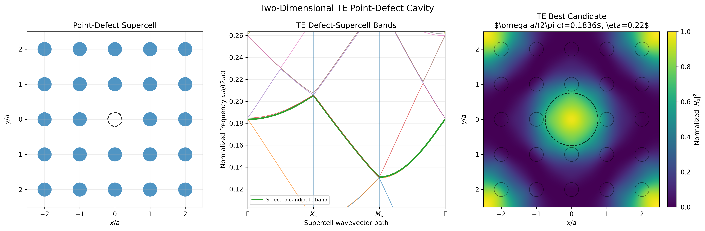
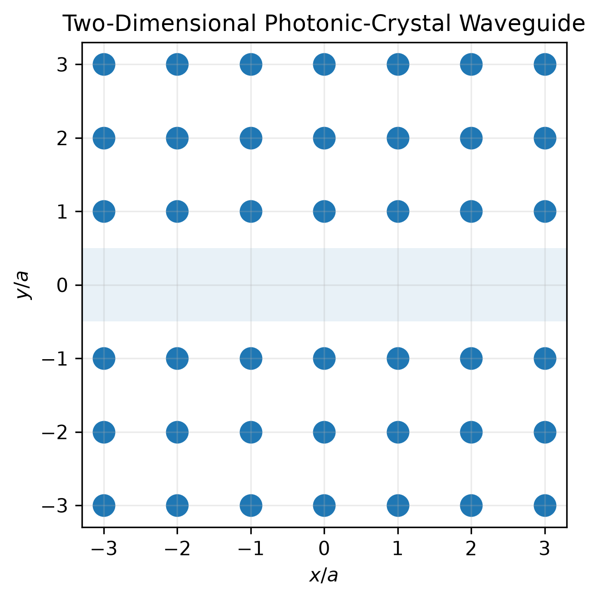
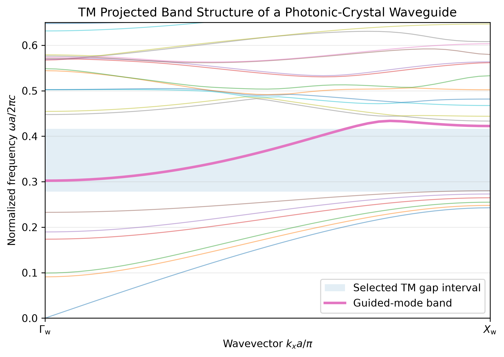
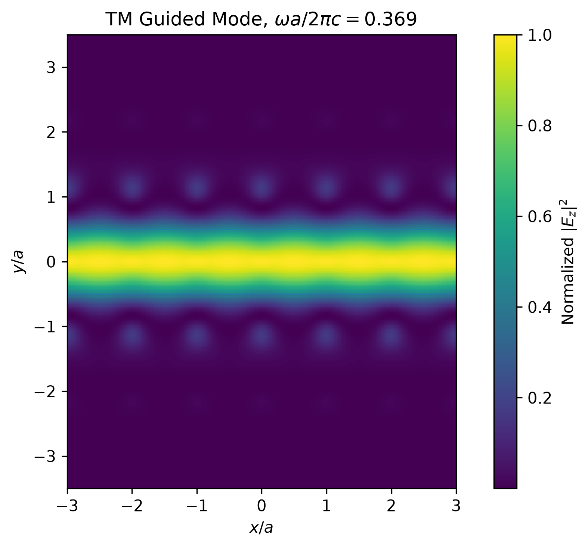

# computational-photonic-crystals

Develop numerical and visual models of one-dimensional and two-dimensional
photonic crystals, progressing from Bragg scattering and Bloch waves to
photonic band structures, band-gap engineering, defect cavities, and
line-defect waveguides.

<p align="center">
  
</p>

## Contents

- [Features](#features)
- [Implemented Modules](#implemented-modules)
  - [One-Dimensional Photonic Crystals](#one-dimensional-photonic-crystals)
  - [Two-Dimensional Photonic Crystals](#two-dimensional-photonic-crystals)
  - [Defect Cavities and Waveguides](#defect-cavities-and-waveguides)
- [Documentation](#documentation)
- [Project Structure](#project-structure)
- [Status](#status)
- [License](#license)

## Features

- One-dimensional transfer-matrix modeling
- Bloch-wave and complex-wavevector calculations
- Photonic band-structure and band-gap identification
- Band-gap parameter studies and band-edge field reconstruction
- One-dimensional defect resonances and transmission analysis
- Two-dimensional reciprocal-lattice and Brillouin-zone construction
- Dielectric and inverse-dielectric Fourier coefficients
- TE and TM plane-wave expansion calculations
- Polarization-dependent and complete band-gap analysis
- Point-defect supercell calculations
- TM and TE cavity-mode comparison
- Line-defect photonic-crystal waveguides
- Guided-mode identification through transverse field confinement
- Real-space electromagnetic-field reconstruction

## Implemented Modules

The repository is organized as a sequence of 18 modules. Each module introduces
one physical idea, implements the corresponding numerical model, and produces
publication-style figures that connect the calculation to its physical meaning.

### One-Dimensional Photonic Crystals

#### P01 — One-Dimensional Periodic Dielectric

**Description**

Construct a one-dimensional periodic dielectric from alternating low- and
high-index layers. This is the base geometry used by the transfer-matrix,
Bloch-wave, and band-structure modules that follow.

**Highlights**

- Periodic refractive-index profile
- Adjustable lattice constant and fill fraction
- Clear distinction between the two dielectric constituents

**Key result:** A ten-cell structure with $n_1=1.0$, $n_2=3.5$, and equal
physical layer widths provides the reference system for P02–P10.

<p align="center">
  
</p>

#### P02 — Bloch Wave Visualization

**Description**

Visualize the periodic envelope, plane-wave factor, and full Bloch wave in a
one-dimensional lattice. A direct translation test verifies that the field
reproduces itself from cell to cell up to a phase factor.

**Highlights**

- Bloch-wave decomposition
- Unit-cell periodicity
- Numerical verification of lattice translation symmetry

**Key result:** The translated field overlaps with the phase-shifted original,
confirming $E_k(x+a)=e^{ika}E_k(x)$.

<p align="center">
  
</p>

<p align="center">
  
</p>

#### P03 — Bragg Scattering and Standing Waves

**Description**

Illustrate Bragg coupling at the first Brillouin-zone boundary. The forward and
backward waves combine into two standing-wave patterns that sample the low- and
high-index regions differently.

**Highlights**

- Bragg scattering at $k=\pi/a$
- Symmetric and antisymmetric standing waves
- Physical origin of the first photonic band gap

**Key result:** The two zone-boundary modes have different dielectric overlap
and therefore split in frequency, opening a band gap.

<p align="center">
  
</p>

#### P04 — Transfer Matrix and Transmission Spectrum

**Description**

Calculate the transmission spectrum of a finite multilayer photonic crystal by
combining interface and propagation matrices across all unit cells.

**Highlights**

- Layer and interface transfer matrices
- Finite-crystal transmission
- Direct observation of photonic stop bands

**Key result:** High-transmission pass bands alternate with strongly suppressed
frequency intervals as a consequence of coherent multiple scattering.

<p align="center">
  
</p>

#### P05 — Allowed and Forbidden Frequency Bands

**Description**

Classify the spectrum of the infinite periodic medium from the trace of the
unit-cell transfer matrix.

**Highlights**

- Bloch function from the unit-cell matrix
- Automatic pass-band and stop-band classification
- Connection between infinite-crystal bands and finite-crystal transmission

The propagation criterion is

```math
\left|\frac{1}{2}\operatorname{Tr}(M_{\mathrm{cell}})\right|\leq 1.
```

**Key result:** Frequencies satisfying the inequality support real Bloch
wavevectors; frequencies outside it form forbidden bands.

<p align="center">
  
</p>

<p align="center">
  
</p>

#### P06 — Complex Bloch Wavevector

**Description**

Extend the Bloch-wave calculation into forbidden frequency intervals and track
both the phase and attenuation of the resulting complex wavevector.

**Highlights**

- Real and imaginary parts of $k(\omega)$
- Propagating-to-evanescent transition
- Quantitative attenuation inside a band gap

**Key result:** The imaginary component vanishes in allowed bands and becomes
nonzero in forbidden bands, producing exponential decay through the crystal.

<p align="center">
  
</p>

#### P07 — Photonic Band Structure

**Description**

Assemble the allowed frequencies into the one-dimensional photonic band
structure along the $X\rightarrow\Gamma\rightarrow X$ path.

**Highlights**

- Normalized frequency and wavevector coordinates
- Multiple photonic bands
- Band gaps visible as empty frequency intervals

**Key result:** Continuous branches identify propagating states, while the
separating intervals contain no real Bloch wavevector.

<p align="center">
  
</p>

#### P08 — Band-Gap Parameter Study

**Description**

Study how refractive-index contrast, fill fraction, and crystal length control
the first one-dimensional photonic band gap and the transmission suppression of
a finite device.

**Highlights**

- Index-contrast sweep
- Fill-fraction optimization
- Finite-size scaling with the number of cells
- Separation of intrinsic band structure from finite-crystal effects

**Key results**

- Raising $n_2$ from $1.5$ to $4.5$ shifts the first gap center from about
  $0.399$ to $0.166$ and increases its relative width from $0.243$ to $0.541$.
- The relative gap width peaks near $f\approx0.80$, close to the
  equal-optical-thickness prediction $f_{\mathrm{opt}}\approx0.778$.
- At the gap center, transmission falls from approximately
  $8.26\times10^{-2}$ for two cells to $3.43\times10^{-15}$ for twenty cells.

<p align="center">
  
</p>

<p align="center">
  
</p>

<p align="center">
  
</p>

#### P09 — One-Dimensional Band-Edge Field Profiles

**Description**

Locate the edges of the first band gap and reconstruct the corresponding
standing-wave intensity profiles across several unit cells.

**Highlights**

- Numerical band-edge detection
- Real-space field reconstruction
- Dielectric-energy interpretation of frequency splitting

**Key result:** The first gap extends approximately from $0.155319$ to
$0.263047$. The lower-edge mode is concentrated mainly in the high-index
layers, whereas the upper-edge mode favors the low-index layers.

<p align="center">
  
</p>

#### P10 — One-Dimensional Defect Mode

**Description**

Break translational symmetry by modifying the central layer of a finite
one-dimensional photonic crystal. The local defect creates a narrow resonant
state inside the surrounding stop band.

**Highlights**

- Defect-layer transfer matrix
- In-gap transmission resonance
- Spatially localized resonant field

**Key result:** A sharp transmission peak appears inside the first stop band,
and its reconstructed field is concentrated around the central defect while
decaying into the Bragg mirrors.

<p align="center">
  
</p>

### Two-Dimensional Photonic Crystals

#### P11 — Two-Dimensional Periodic Dielectric

**Description**

Construct a square lattice of circular dielectric rods and visualize its
two-dimensional real-space permittivity distribution.

**Highlights**

- Square-lattice geometry
- Circular dielectric rods
- Adjustable radius and dielectric contrast
- Real-space foundation for the reciprocal-space calculations

**Key result:** The periodic rod array provides the base two-dimensional
geometry used throughout P12–P18.

<p align="center">
  
</p>

#### P12 — Reciprocal Lattice and Brillouin Zone

**Description**

Construct the reciprocal lattice, first Brillouin zone, and standard
$\Gamma\rightarrow X\rightarrow M\rightarrow\Gamma$ wavevector path for the
square photonic crystal.

**Highlights**

- Reciprocal-lattice vectors
- First Brillouin zone
- High-symmetry points
- Wavevector sampling for band calculations

**Key result:** Lattice symmetry reduces the band calculation to the conventional
high-symmetry boundary of the irreducible Brillouin zone.

<p align="center">
  
</p>

#### P13 — Fourier Coefficients of the Dielectric Function

**Description**

Calculate and visualize the Fourier coefficients of the dielectric and inverse
dielectric functions for circular rods on a square lattice.

**Highlights**

- Analytic circular-inclusion form factor
- Dielectric and inverse-dielectric coefficients
- Hermitian convolution matrices
- Reciprocal-space input for plane-wave expansion

**Key result:** The reciprocal-space coefficients retain the expected square
symmetry and supply the convolution matrices used by the TE and TM solvers.

<p align="center">
  
</p>

#### P14 — Two-Dimensional TE and TM Band Structure

**Description**

Solve the TE and TM Maxwell eigenvalue problems with the plane-wave expansion
method and calculate the bands of a square lattice of dielectric rods.

**Highlights**

- TE and TM eigenvalue formulations
- Plane-wave basis in reciprocal space
- Square-lattice high-symmetry path
- Polarization-dependent dispersion

**Key result:** TE and TM bands respond differently to the same dielectric
geometry, demonstrating the strong polarization dependence of a two-dimensional
photonic crystal.

<p align="center">
  
</p>

#### P15 — Complete Photonic Band-Gap Search

**Description**

Extract frequency intervals between neighboring TE and TM bands, compare their
polarization-specific gaps, and identify any overlap that forms a complete
two-dimensional photonic band gap.

**Highlights**

- Automatic band-gap extraction
- TE–TM overlap analysis
- Complete-gap identification
- Direct connection between bulk bands and defect-state searches

**Key result:** Polarization-specific gaps provide the reference windows used to
search for localized cavity states and guided waveguide modes in P16–P18.

<p align="center">
  
</p>

### Defect Cavities and Waveguides

#### P16 — Two-Dimensional TM Point-Defect Cavity

**Description**

Introduce a missing rod into a square-lattice supercell, solve the TM defect
bands, and reconstruct candidate cavity fields in real space.

**Highlights**

- Point-defect supercell geometry
- Folded TM band structure
- In-gap state search
- Quantitative field-localization analysis

The localization factor is evaluated from the fraction of modal intensity in a
region surrounding the missing rod:

```math
\eta_{\mathrm{loc}}
=\frac{\int_{\mathrm{defect}} |E_z|^2\,dA}
{\int_{\mathrm{supercell}} |E_z|^2\,dA}.
```

**Key result:** The localized TM cavity mode occurs at approximately
$\omega a/(2\pi c)=0.3797$. Its strong defect-region localization, measured by
$\eta_{\mathrm{loc}}$, distinguishes it from the extended folded bands.

<p align="center">
  
</p>

#### P17 — Two-Dimensional TE Point-Defect Cavity

**Description**

Apply the same supercell workflow to the TE polarization and test whether the
same missing-rod geometry produces a comparable in-gap cavity state.

**Highlights**

- TE supercell eigenvalue problem
- Bulk-gap and defect-band comparison
- Polarization-selective defect response
- Polarization-dependent cavity comparison

**Key result:** Unlike the TM calculation, the selected geometry does not
produce a suitable low-frequency in-gap TE cavity mode. This negative result
demonstrates that a defect effective for one polarization need not confine the
other.

<p align="center">
  
</p>

#### P18 — Photonic-Crystal Waveguide

**Description**

Remove one complete row of rods to form a W1 line defect, calculate the TM
projected band structure of the rectangular supercell, and identify a guided
mode through transverse field confinement.

**Highlights**

- Line-defect waveguide geometry
- Rectangular supercell and reciprocal basis
- TM projected bands along the propagation direction
- Guided-mode selection inside a bulk-gap search interval
- Real-space field reconstruction and confinement measurement

The confinement factor measures the fraction of modal intensity inside a strip
of width $w$ centered on the waveguide:

```math
\eta_{\mathrm{conf}}
=\frac{\int_{|y|\leq w/2}|E_z(x,y)|^2\,dx\,dy}
{\int |E_z(x,y)|^2\,dx\,dy}.
```

**Key result:** At the selected wavevector, candidate band 6 has normalized
frequency $\omega a/(2\pi c)\approx0.3687$ and confinement
$\eta_{\mathrm{conf}}\approx0.7995$. The field is concentrated in the missing
row and decays rapidly into the surrounding crystal. A lower candidate near
$0.2554$ has confinement of only about $0.0138$ and is therefore rejected as an
extended state.

<p align="center">
  
</p>

<p align="center">
  
</p>

<p align="center">
  
</p>

## Documentation

The detailed physical models, parameters, equations, numerical procedures,
figures, and interpretations from the original project documentation are
available in the following module pages.

### One-Dimensional Photonic Crystals

- [P01 — One-Dimensional Periodic Dielectric](docs/P01.md)
- [P02 — Bloch Wave Visualization](docs/P02.md)
- [P03 — Bragg Scattering and Standing Waves](docs/P03.md)
- [P04 — Transfer Matrix and Transmission Spectrum](docs/P04.md)
- [P05 — Allowed and Forbidden Frequency Bands](docs/P05.md)
- [P06 — Complex Bloch Wavevector](docs/P06.md)
- [P07 — Photonic Band Structure](docs/P07.md)
- [P08 — Band-Gap Parameter Study](docs/P08.md)
- [P09 — One-Dimensional Band-Edge Field Profiles](docs/P09.md)
- [P10 — One-Dimensional Defect Mode](docs/P10.md)

### Two-Dimensional Photonic Crystals

- [P11 — Two-Dimensional Periodic Dielectric](docs/P11.md)
- [P12 — Reciprocal Lattice and Brillouin Zone](docs/P12.md)
- [P13 — Fourier Coefficients of the Dielectric Function](docs/P13.md)
- [P14 — Two-Dimensional TE and TM Band Structures](docs/P14.md)
- [P15 — Complete Photonic Band-Gap Search](docs/P15.md)

### Defect Cavities and Waveguides

- [P16 — Two-Dimensional TM Point-Defect Cavity](docs/P16.md)
- [P17 — Two-Dimensional TE Point-Defect Cavity](docs/P17.md)
- [P18 — Photonic Crystal Waveguide](docs/P18.md)

## Project Structure

```text
computational-photonic-crystals/
├── docs/
│   ├── P01.md
│   ├── ...
│   └── P18.md
├── figures/
│   ├── p01_*.png
│   ├── ...
│   └── p18_*.png
├── scripts/
│   ├── p01_periodic_dielectric.py
│   ├── ...
│   └── p18_photonic_crystal_waveguide.py
├── utils/
│   ├── field_reconstruction_utils.py
│   ├── plane_wave_expansion_utils.py
│   └── waveguide_utils.py
├── requirements.txt
├── LICENSE
├── .gitignore
└── README.md
```

- `docs/` contains the complete physical and numerical documentation for each module.
- `scripts/` contains the executable P01–P18 modules.
- `utils/` contains shared transfer-matrix, plane-wave-expansion, geometry, and
  field-reconstruction routines.
- `figures/` contains the generated visual results used throughout this README.

## Status

The introductory P01–P18 sequence is complete. It currently covers:

- one-dimensional periodic media, band structures, and defect resonances;
- two-dimensional TE and TM plane-wave expansion;
- polarization-dependent bulk band gaps;
- point-defect cavity states; and
- a line-defect waveguide with quantitative mode-confinement analysis.

Possible future extensions include convergence studies, group velocity and
slow-light analysis, automated transfer of bulk-gap bounds to defect searches,
finite-difference time-domain simulations, and cavity quality-factor estimates.

## License

This project is distributed under the MIT License. See `LICENSE` for the full
license text.

Copyright (c) 2026 Guoran Yao.
