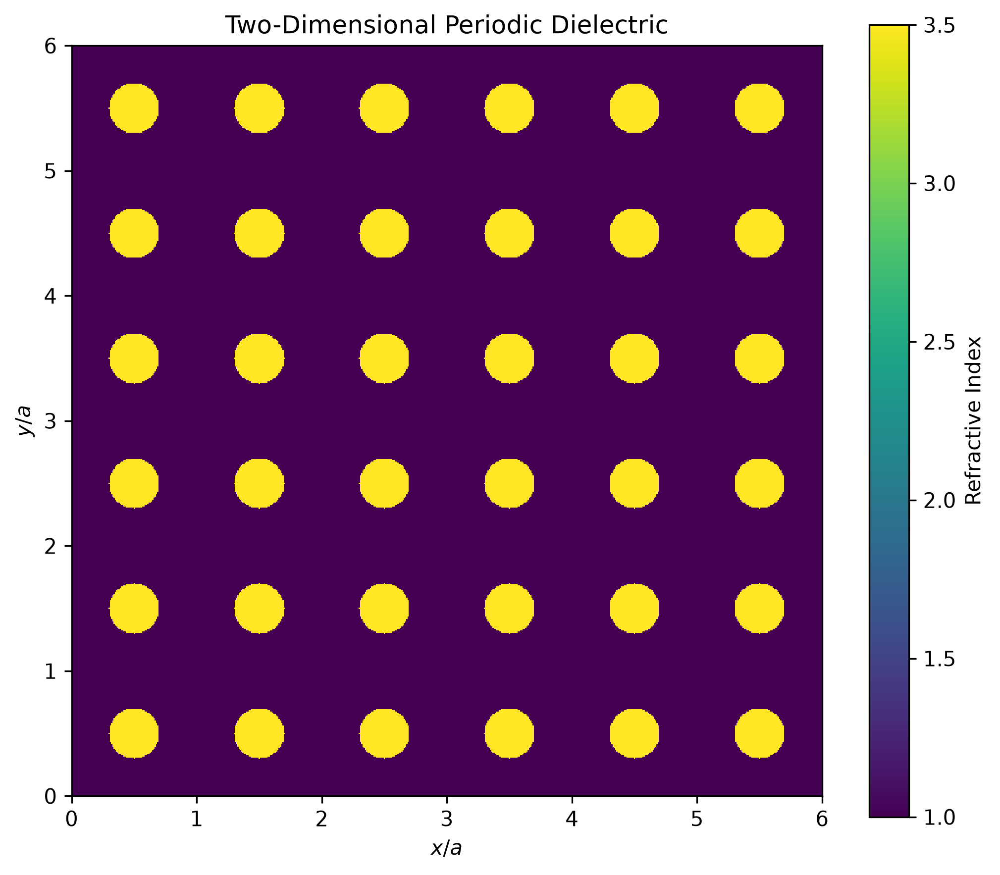

[← Back to project README](../README.md)

# P11 — Two-Dimensional Periodic Dielectric

Construct and visualize a two-dimensional square lattice of dielectric rods
embedded in an air background.

#### Parameters

- Background refractive index: $n_{\mathrm{bg}} = 1.0$
- Rod refractive index: $n_{\mathrm{rod}} = 3.5$
- Lattice constant: $a = 1.0$
- Rod radius: $r = 0.2a$
- Number of unit cells: $6 \times 6$

#### Model

Identical circular dielectric rods are placed at the center of each unit cell
of a two-dimensional square lattice. The refractive-index distribution is
periodic along both the $x$- and $y$-directions:

```math
n(x + a, y) = n(x, y),
```

```math
n(x, y + a) = n(x, y).
```

A point $(x,y)$ lies inside a rod centered at $(x_c,y_c)$ when

```math
(x-x_c)^2 + (y-y_c)^2 \leq r^2.
```

The relative permittivity is obtained from

```math
\varepsilon_r(x,y) = n^2(x,y).
```

#### Output

<p align="center">
  
</p>

The resulting structure serves as the real-space geometric foundation for
two-dimensional reciprocal-lattice, Brillouin-zone, and photonic-band
calculations.
