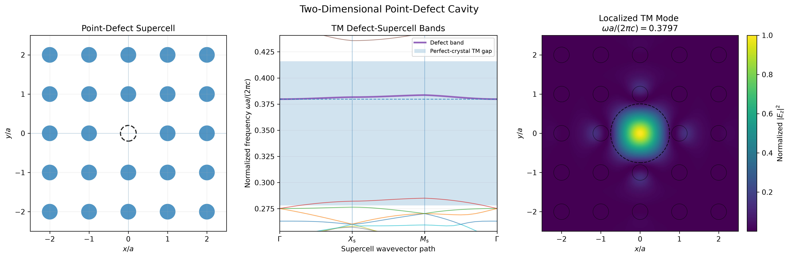

[← Back to project README](../README.md)

# P16 — Two-Dimensional TM Point-Defect Cavity

Introduce a point defect into the two-dimensional square lattice by removing
the central dielectric rod from a finite supercell, and calculate the resulting
TM defect-supercell band structure and localized cavity mode.

#### Parameters

- Background refractive index: $n_{\mathrm{bg}} = 1.0$
- Rod refractive index: $n_{\mathrm{rod}} = 3.5$
- Primitive lattice constant: $a = 1.0$
- Rod radius: $r = 0.2a$
- Supercell size: $5\times5$
- Supercell side length: $L=5a$
- Supercell reciprocal-lattice index limit: $N=7$
- Number of supercell plane waves: $225$
- Number of calculated supercell bands: $32$
- Localization radius: $0.75a$

#### Point-Defect Supercell

A $5\times5$ supercell is constructed from the primitive square lattice, and
the central dielectric rod is removed to create a point defect.

The perfect supercell contains $25$ rods, while the defect supercell contains
$24$. Although primitive-cell translational symmetry is broken, periodic
boundary conditions are retained at the supercell level. The numerical model
therefore represents a periodic array of identical defects separated by
$L=5a$.

A larger supercell would reduce the interaction between neighboring periodic
copies and more closely approximate an isolated cavity.

The enlarged real-space period reduces the Brillouin-zone dimensions by a
factor of five. The supercell bands are evaluated along

```math
\Gamma_s
\rightarrow
X_s
\rightarrow
M_s
\rightarrow
\Gamma_s.
```

#### Band Folding

Because the supercell Brillouin zone is smaller than the primitive Brillouin
zone, each primitive-cell band is folded into multiple supercell bands.

These folded bands do not represent new physical modes by themselves. They
arise because wavevectors that were distinct in the primitive Brillouin zone
become equivalent modulo supercell reciprocal-lattice vectors.

The point defect perturbs the folded supercell bands and may introduce a
localized defect band inside a photonic band gap of the perfect crystal.

#### Supercell Material Representation

The defect-supercell dielectric function is represented using the Fourier
method introduced in P13.

For the supercell, the Fourier coefficients include the phase contributions
from all rod positions. Removing the central rod changes this structure factor
and therefore modifies the dielectric convolution matrix used in the Maxwell
eigenvalue problem.

#### TM Supercell Eigenvalue Problem

For TM polarization, the nonzero out-of-plane field component is $E_z$.

The same generalized plane-wave eigenvalue problem introduced in P14 is solved
using the defect-supercell reciprocal vectors and dielectric convolution
matrix:

```math
A^{\mathrm{TM}}\mathbf E
=
\frac{\omega^2}{c^2}
B^{\mathrm{TM}}\mathbf E.
```

Frequencies are normalized using the primitive lattice constant,

```math
\frac{\omega a}{2\pi c},
```

so that the supercell spectrum can be compared directly with the
perfect-crystal bands and gaps from P14 and P15.

#### Field Reconstruction and Localization

The selected eigenvector is reconstructed in real space as

```math
E_z(\mathbf r)
=
\sum_{\mathbf G}
E_{\mathbf G}
e^{i(\mathbf k+\mathbf G)\cdot\mathbf r}.
```

The normalized intensity is

```math
I_{\mathrm{normalized}}(\mathbf r)
=
\frac{|E_z(\mathbf r)|^2}
{\max_{\mathbf r}|E_z(\mathbf r)|^2}.
```

Localization is quantified by the fraction of total sampled intensity inside a
circle of radius $R=0.75a$ centered on the missing rod:

```math
\eta
=
\frac{
\displaystyle
\sum_{|\mathbf r|\leq R}
|E_z(\mathbf r)|^2
}{
\displaystyle
\sum_{\mathrm{supercell}}
|E_z(\mathbf r)|^2
}.
```

#### Defect-Mode Result

The defect-supercell spectrum contains a nearly dispersionless band inside the
first TM band gap of the perfect crystal.

The selected mode has normalized frequency

```math
\frac{\omega a}{2\pi c}
\approx
0.3797,
```

with localization fraction

```math
\eta
\approx
0.77.
```

The weak dispersion indicates limited coupling between neighboring periodic
copies of the cavity, while the large localization fraction confirms that the
field is concentrated near the missing rod.

#### Output

<p align="center">
  
</p>

The figure combines the missing-rod supercell, the TM defect-supercell bands,
and the normalized $|E_z|^2$ distribution. The highlighted nearly flat band
lies inside the perfect-crystal TM gap, and its field is strongly localized
around the central defect.

This demonstrates the formation of a genuine two-dimensional TM
photonic-crystal cavity mode through band-gap confinement.
